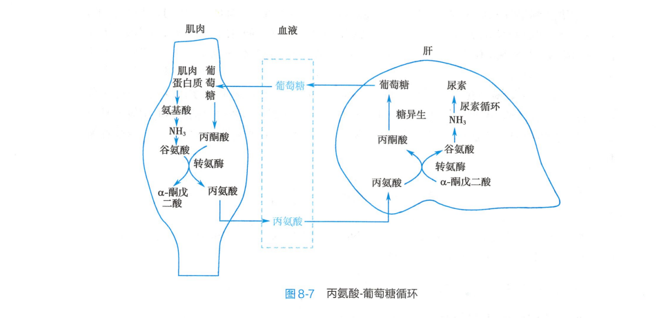

***

# 参考：人卫9 版生物化学与分子生物学，维基百科

# 三羧酸循环

**三羧酸循环**是生物体内最重要的循环之一，是三大营养物质的代谢枢纽，通过脱氢提供还原当量从而进行电子传递和氧化磷酸化生成ATP 。

## 过程

①来自丙酮酸脱氢生成的**乙酰CoA** 和**草酰乙酸**在**柠檬酸合酶**作用下生成**柠檬酸**，此为**第一个****限速步骤**；②**柠檬酸**经**顺乌头酸**转化为**异柠檬酸**；③**异柠檬酸**在**异柠檬酸脱氢酶**作用下氧化脱羧转变为**α -酮戊二酸**，脱下的氢由**NAD+ ** 接受生成**NADH +H+** ，此为**第一次****氧化脱羧**，也是**第二个****限速步骤**；④**α -酮戊二酸**在**α -酮戊二酸脱氢酶复合体**作用下氧化脱羧生成**琥珀酰CoA** ，脱下的氢由**NAD+ ** 接受生成**NADH +H+** ，此为**第二次**氧化脱羧，也是**第三个****限速步骤**；⑤**琥珀酰CoA **在**琥珀酰CoA 合成酶**作用下水解生成**琥珀酸**，同时与**核苷二磷酸**偶联，是**唯一**一次**底物水平磷酸化**；⑥**琥珀酸**在**琥珀酸脱氢酶**作用下脱氢生成**延胡索酸**，脱下的氢由**FAD** 接受生成**FADH2** ；⑦**延胡索酸**在**延胡索酸酶**作用下生成**苹果酸**；⑧**苹果酸**在**苹果酸脱氢酶**作用下脱氢生成**草酰乙酸**，脱下的氢由**NAD+** 接受生成**NADH+** 。

记忆口诀：`草酰乙酰成柠檬，异柠檬又成α 酮，琥酰琥珀延胡索，苹果落在草丛中。`（来自天天师兄）

## 特点

记住“1 ,2 ,3 ,4 ,5 ”

1 ：一次**底物水平磷酸化**，第五步**琥珀酰CoA ** 水解为**琥珀酸**时底物水平磷酸化，产生`1 `分子ATP 。

2 ：两次脱羧，分别在第三步和第四步。

3 ：三个限速酶，依次分别是**柠檬酸合酶**、**异柠檬酸脱氢酶**、**α -酮戊二酸脱氢酶**。

4 ：四次脱氢，第三步、第四步、第六步和第八步，其中第六步由**FAD** 受氢，其余三步均为**NADH** 。

5 ：循环过程中，共有五步产能：第三步产生`2.5 ` 分子ATP ，第四步产生`2.5 `分子ATP ，第五步产生`1` 分子ATP ，第六步产生`1.5` 分子ATP ，第八步产生`2.5` 分子ATP ，故一分子**乙酰CoA** 参与三羧酸循环产生`2.5 +2.5 +1 +1.5 +2.5 = 10` 分子ATP 。由于一分子葡萄糖进入糖酵解产生`2` 分子**3 -磷酸甘油醛**，其后所有能量计算都要*2 ，故一分子葡萄糖经过三羧酸循环产生`20` 分子ATP 。

## 意义

1 ：TCA 是三大营养物质分解产能的共同通路。三大营养物质分解代谢最终都产生**乙酰CoA **进入TCA 而彻底氧化。TCA 并不直接产能，但是能提供足够的还原当量进入呼吸链，经氧化磷酸化产生大量ATP 。

2 ：TCA 是糖、脂肪、氨基酸代谢的联系枢纽，三大营养物质通过TCA 一定程度上相互转变。

## 调节

||调节机制|抑制剂|激活剂|
|:--:|:--:|:--:|:--:|
|**柠檬酸合酶**|反馈抑制|NADH 、琥珀酰CoA 、ATP 、柠檬酸|ADP|
|**异柠檬酸脱氢酶**|反馈抑制|ATP|ADP 、Ca2+|
|**α -酮戊二酸脱氢酶**|反馈抑制|ATP 、NADH 、琥珀酰CoA|Ca2+|

***

# 丙氨酸-葡萄糖循环

**氨**在人体内有毒，在血液中以**丙氨酸**或**谷氨酰胺**两种形式运输。

## 过程

骨骼肌通过转氨基作用将**丙酮酸**转化为**丙氨酸**，经血液到达肝脏后通过联合脱氨基作用生成**丙酮酸**并释放**氨**，**丙酮酸**经糖异生合成**葡萄糖**，**氨**用于合成**尿素**。**葡萄糖**经血到肌肉，糖酵解成为**丙酮酸**。

## 意义

使肌肉中的**氨**以无毒的**丙氨酸**形式运送至肝，同时肝又提供了生成**丙酮酸**的葡萄糖。

***

# 柠檬酸-丙酮酸循环

# 鸟氨酸循环

# 乳酸循环

# 甲硫氨酸循环

