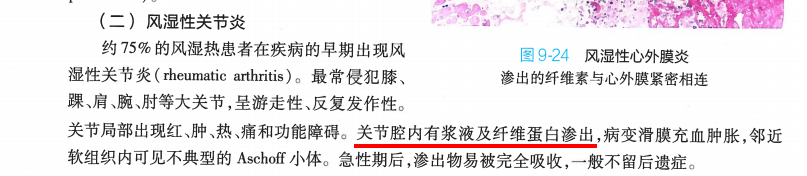
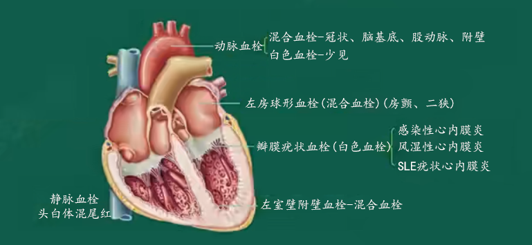
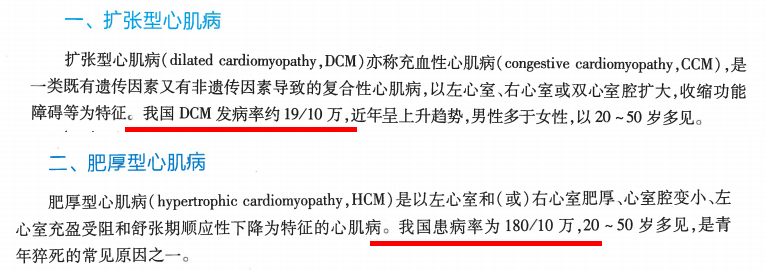
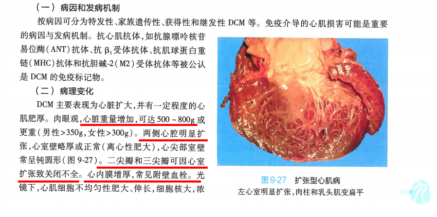
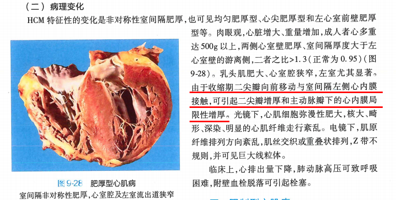

<script type="text/javascript">alert("病理还得看贺银成。贺门！");</script>
<iframe frameborder="no" border="0" marginwidth="0" marginheight="0" width=330 height=86 src="//music.163.com/outchain/player?type=2&id=857881&auto=0&height=66"></iframe>

# <font color=#ff3030 >**考纲**</font>
>***1.风湿病的病因、发病机制、基本病理改变及各器官的病理变化。
2.心内膜炎的分类及其病因、发病机制、病理改变、合并症和结局。
3.心瓣膜病的类型、病理改变、血流动力学改变和临床病理联系。
4.高血压病的概念、发病机制，良性高血压的分期及其病理变化，恶性高血压的病理特点。
5.动脉粥样硬化的病因、发病机制及基本病理变化，各器官的动脉粥样硬化所引起的各脏器的病理改变和后果。
6.心肌病的概念，克山病、充血性心肌病、肥厚阻塞性心肌病及闭塞性心肌病的病理学特点。
7.心肌炎的概念、病理学类型及其病理特点。***
***
# <font color=#ff3030 >**风湿病**</font>
## 病因
|||
|:--:|:--:|
|**发病原因**|与A组乙型溶血性链球菌感染有关|
|**临床表现**|发热、心脏和关节损害、环形红斑、皮下小结和舞蹈病，可累及全身结缔组织及血管，<font color=#eeee00>**最常**</font>侵犯心（<font color=#eeee00>**最严重**</font>）、关节和血管|
|**病理特征**|特征病变是<font color=#eeee00>**风湿肉芽肿**</font>，即<font color=#eeee00>**Aschoff小体**</font>|

`2013N133B对风湿病最有诊断意义的病变是` C

`2013N134B对风湿病人造成最严重危害的病变是` D
```306
A.关节病变
B.心包内纤维蛋白性炎症
C.心肌内Aschoff小体
D.心内膜炎
```
## 发病机制
|||
|:--:|:--:|
|**A组溶血性链球菌**|<font color=#eeee00>**M蛋白抗原**</font>可以起交叉免疫，是“<font color=#eeee00>**致风湿源性**</font>”|
|**自身免疫反应**|见**七版免疫学**22页“交叉抗原”|
|**遗传易感性**|风湿热患者亲属患病率更高|
|**链球菌毒素**|链球菌分泌的细胞外毒素和酶可破坏机体组织器官|

## <font color=#ff3030>**基本病理变化**</font>
### 时期
||变质渗出期（早期）|增生期（肉芽肿期）|纤维化期（硬化期）|
|:--:|:--:|:--:|:--:|
|**病程**|持续1月|持续2~3月|持续2~3月|
|**特征**|<font color=#eeee00>**胶原的纤维素样坏死**</font>|<font color=#eeee00>**Aschoff小体形成**</font>|<font color=#eeee00>**梭形瘢痕形成**</font>|
|**其他病变**|结缔组织基质黏液样变性，胶原纤维素样坏死，少量淋巴、单核、浆细胞浸润|同渗出期|Aschoff小体内坏死细胞被吸收|

`2011N48A风湿性病变质渗出期的主要病变是` A
```306
A.纤维素样坏死形成
B.阿绍夫小体形成
C.梭形瘢痕形成
D.小化脓灶形成
```
### <font color=#ff3030>**Aschoff小体**</font>
|||
|:--:|:--:|
|**特点**|肉芽肿性病变，是风湿病增生期的<font color=#eeee00>**特征性病变**</font>|
|**组成**|Aschoff细胞、浆细胞、Aschoff巨细胞、少量T细胞|
|**部位**|多位于纤维素样坏死灶内；在<font color=#eeee00>**心肌间质**</font>内多位于<font color=#eeee00>**小血管**</font>旁|
|**来源**|巨噬细胞吞噬纤维素样坏死物质后形成|

`2015N48A风湿小结内的阿绍夫细胞来源于` C
```306
A.T淋巴细胞
B.B淋巴细胞
C.巨噬细胞
D.成纤维细胞
```
## <font color=#ff3030>**风湿的各器官病理变化**</font>
### <font color=#ff3030 >**风湿性心脏病**</font>
||风湿性心内膜炎|风湿性心肌炎|风湿性心外膜炎|
|:--:|:--:|:--:|:--:|
|**部位**|二尖瓣最常见|<font color=#eeee00>**心肌间质**</font>结缔组织|心外膜脏层（心包）|
|**特征**|瓣膜<font color=#eeee00>**疣状赘生物**</font>|间质血管附近<font color=#eeee00>**Aschoff小体**</font>|浆液或纤维素样渗出|
|**其他病变**|瓣膜（主要是二尖瓣或二尖瓣主动脉瓣同时受累）肿胀变性，赘生物纤维素样坏死，<font color=#eeee00>**左心房后壁增厚，称McCallum斑**</font>|少量淋巴细胞浸润|心外膜脏层浆液性炎或纤维素性炎；前者可致心包积液，后者致绒毛心、缩窄性心外膜炎|

`1992N32A关于风湿病的描述，哪一项是错误的` C<font color=#1e90ff>**<sup>1</sup>**</font>
```306
A.风湿性心内膜炎最常累及二尖瓣和主动脉瓣
B.心内膜炎疣状赘生物不易脱落
C.风湿性心肌炎可导致心肌广泛纤维化
D.风湿性心外膜炎可导致心包粘连
E.风湿性关节炎不会导致关节畸形
```
><font color=#1e90ff>**<sup>1</sup>答案有争议**</font>：<font color=#ff3030>**风湿性心肌炎**</font>反复发作时，<font color=#40e0d0>**心肌间质**</font>中的<font color=#40e0d0>**Aschoff小体**</font>纤维化形成梭形瘢痕，可导致<font color=#ff3030>**心肌纤维化**</font>，故C项正确。
>对此老贺的解释是：<font color=#ff3030>**风湿性心肌炎**</font>导致的是<font color=#ff3030>**心肌间质纤维化**</font>而非<font color=#ff3030>**心肌纤维化**</font>。
>区别在于：<font color=#ff3030>**心肌纤维化**</font>强调的是<font color=#40e0d0>**间质结缔组织**</font>纤维化，作为<font color=#40e0d0>**心肌实质**</font>的心肌细胞不受累；而<font color=#ff3030>**心肌纤维化**</font>强调的是<font color=#40e0d0>**心肌实质**</font>细胞坏死并发<font color=#40e0d0>**间质结缔组织**</font>增生纤维化，例如<font color=#ff3030>**心梗**</font>。
>贺门！

### 风湿性关节炎

||风湿性关节炎|类风湿性关节炎|
|:--:|:--:|:--:|
|**起病**|亚急性|缓慢|
|**累及**|膝、肩、腕、肘关节|腕、掌指关节、近端指间关节|
|**病变**|滑膜充血、肿胀|滑膜炎性渗出、滑膜下血管扩张|
|**渗出**|<font color=#eeee00>**浆液和纤维素**</font>渗出、易吸收|<font color=#eeee00>**纤维素**</font>渗出、不易吸收|
|**畸形**|<font color=#eeee00>**不留关节畸形**</font>|<font color=#eeee00>**遗留关节畸形**</font>|
|**特征**|游走性疼痛，反复发作|对称性持续关节痛，时轻时重|

`2017N126B急性蜂窝织炎性阑尾炎的病理特点` A

`2017N127B风湿性关节炎的病理特点` C<font color=#1e90ff>**<sup>2</sup>**</font>
```306
A.化脓性炎
B.纤维素性炎
C.浆液性炎
D.变质性炎
```
><font color=#1e90ff>**<sup>2</sup>答案有争议**</font>:在5版病理学教材中明确指出<font color=ff3030>**风湿性关节炎**</font>是<font color=#bdfcc9>**浆液性炎**</font>，而在9版教材中则定性为<font color=#bdfcc9>**浆液及纤维素渗出**</font>，故此题无解。


`1998N41A下列有关风湿病的描述，哪项是错误的` B
```306
A.可引起缩窄性心包炎
B.风湿性关节炎是纤维素性炎
C.风湿性肉芽肿具有诊断意义
D.Aschoff细胞可能为巨噬细胞源性
E.Aschoff小体内淋巴细胞主要是T细胞
```
`2018N34A下列对风湿热的描述，错误的是` C
```306
A.属于变态反应性疾病
B.发病与溶血性链球菌感染有关
C.常可导致关节畸形
D.心脏病变对人体危害最大
```
#### 皮肤病变（具有诊断意义

|              |                           临床特点                           | 性质       |
| ------------ | :----------------------------------------------------------: | ---------- |
| **环形红斑** |         多见于躯干和四肢皮肤，好发于儿童，1~2天消退          | 渗出性病变 |
| **皮下结节** | 多见于关节伸侧面皮下结缔组织，镜下见结节中心为大片<font color=#eeee00>**纤维素样坏死物**</font>，Aschoff细胞放射状排列，淋巴细胞浸润 | 增生性病变 |

`2016N168X在风湿热病变中，可以出现Aschoff小体的有` ABC<font color=#1e90ff>**<sup>3</sup>**</font>
```306
A.风湿性心肌炎
B.风湿性动脉炎
C.皮下结节
D.环形红斑
```
><font color=#1e90ff>**<sup>3</sup>9版教材无相关表述**</font>：在5版病理学教材中，<font color=#ff3030>**环形红斑**</font>具有诊断意义，镜下为<font color=#bdfcc9>**非特异炎**</font>，无<font color=#40e0d0>**Aschoff小体**</font>形成。

### 风湿性脑病

|              |                                    |
|:--:|:--:|
| **好发于**   | 5~12岁儿童，女孩多见               |
| **主要病变** | 脑的风湿性动脉炎、皮质下脑炎       |
| **小舞蹈症** | 锥体外系受累时，出现肢体不自主运动 |

`1997N74A哪项急性风湿病伴发心脏炎的几率最低` C<font color=#1e90ff>**<sup>4</sup>**</font>
```306
A.关节炎
B.皮下结节
C.舞蹈病
D.环形红斑
E.血管炎
```
><font color=#1e90ff>**<sup>4</sup>9版教材无相关表述**</font>：1~9版教材均无相关表述。
***
# <font color=#ff3030 >**感染性心内膜炎**</font>

## 分类

|                      |                                                              |
| :------------------: | ------------------------------------------------------------ |
|       **定义**       | 感染性心内膜炎是病原微生物经血直接侵袭心内膜特别是<font color=#eeee00 >**心瓣膜**</font>而引起的炎症性疾病，常伴<font color=#eeee00 >**赘生物**</font>形成 |
|   **根据病情分类**   | 急性感染性心内膜炎、亚急性感染性心内膜炎                     |
| **根据瓣膜类型分类** | 自体瓣膜心内膜炎、人工瓣膜心内膜炎                           |

## 病因

|                |                                                              |
| :------------: | :----------------------------------------------------------: |
| **自体瓣膜型** | 急性：<font color=#eeee00 >**金葡菌**</font>最多见，亦有肺炎球菌、流感杆菌、淋球菌；亚急性：<font color=#eeee00 >**草绿色葡萄球菌**</font>最多见，亦有肠球菌 |
| **人工瓣膜型** | 早期：手术感染，多为表皮葡萄球菌、金葡菌；晚期：一过性菌血症所致，多为金葡菌（50%） |

## 发病机制

|                        |                                                              |
| :--------------------: | :----------------------------------------------------------: |
|     **赘生物形成**     | 血流形成涡流，病原菌沉积生长，受血流冲击处内膜损伤，形成赘生物 |
| **赘生物导致的并发症** | 病原体在赘生物中繁殖引起菌血症；赘生物脱离，可致外周血管阻塞，形成转移性脓肿；赘生物可致瓣膜穿孔破裂、心肌脓肿 |
|      **反复感染**      |                 激活免疫系统引起变态反应炎症                 |

## <font color=#ff3030>**病理变化**</font>

### <font color=#ff3030>**急性感染性心内膜炎**</font>

|||
| :--: | :--: |
|**脓毒血症**|病原体感染，若抵抗力降低，细菌入血引起脓毒血症|
|**赘生物**|由脓性渗出物、血栓、坏死组织等组成，侵犯<font color=#eeee00 >**二尖瓣、主动脉瓣**</font><font color=#1e90ff>**<sup>5</sup>**</font>，引起<font color=#eeee00 >**急性化脓性心瓣膜炎**</font>|
|**并发症**|赘生物脱落可引起心脑肾脾感染性梗死和脓肿|

><font color=#1e90ff>**<sup>5</sup>教材相互矛盾**</font>：按病理学教材观点，应为<font color=#40e0d0>**二尖瓣**</font>；按内科学教材观点，应为<font color=#40e0d0>**主动脉瓣**</font>。699不考内科，若遇到A型题则选<font color=#40e0d0>**二尖瓣**</font>，遇到X型题则两个都选。

### <font color=#ff3030>**亚急性感染性心内膜炎**</font>
|||
|:--:|:--:|
|**心脏**|常侵犯<font color=#eeee00 >**二尖瓣、主动脉瓣**</font>，瓣膜上形成赘生物，可致狭窄、关闭不全等|
|**血管**|赘生物脱落可致动脉性栓塞，<font color=#eeee00>**脑栓塞**</font>多见；由于栓子含菌极少，常为<font color=#eeee00>**无菌性梗死**</font>|
|**变态反应**|微栓塞可致局灶性或弥漫性肾炎，皮肤出现<font color=#eeee00>**Osler小结**</font>|
|**败血症**|脱落赘生物中的细菌侵入血流并在其中繁殖|

`2004N137X亚急性感染性心内膜炎可引起` ABCD
```306
A.心瓣膜变形
B.局灶性肾小球肾炎
C.无菌性坏死
D.Osler小结
```
## <font color=#ff3030>**三种心内膜炎的比较**</font>
||风湿性心内膜炎|急性感染性心内膜炎|亚急性感染性心内膜炎|
|:--:|:--:|:--:|:--:|
|**别名**|疣状心内膜炎|急性细菌性心内膜炎|亚急性细菌性心内膜炎|
|**致病菌**|<font color=#eeee00 >**A组溶血链球菌**</font>|<font color=#eeee00 >**金葡菌**</font>|<font color=#eeee00 >**草绿色链球菌**</font>|
|**受累部位**|二尖瓣>二尖瓣+主动脉瓣|二尖瓣+主动脉瓣|二尖瓣+主动脉瓣|
|**赘生物**|位于瓣膜闭锁缘上，细小灰白色，主要成分为血小板和纤维素，<font color=#eeee00 >**不易脱落**</font>，不含细菌|位于瓣膜表面，体积庞大灰黄或浅绿色，主要成分为脓性渗出物、血栓、坏死组织和菌落，<font color=#eeee00 >**最易脱落**</font>形成菌栓，含菌|位于瓣膜上，息肉状或菜花状，主要成分为血小板、纤维素、中性粒细胞和坏死组织，<font color=#eeee00 >**较易破碎脱落**</font>，不含或含极少细菌|

`2006N117B风湿性心内膜炎的发生` C

`2006N118B亚急性细菌性心内膜炎的发生` B
```306
A.由致病力强的化脓菌引起
B.由致病力弱的草绿色链球菌引起
C.与A组乙型溶血链球菌有关
D.与系统性红斑狼疮有关
E.与慢性消耗性疾病有关
```
`2009N55A风湿病时，心内膜疣状赘生物属于` A
```306
A.白色血栓
B.红色血栓
C.混合血栓
D.透明血栓
```


`2010N47A风湿性心内膜炎时，心瓣膜疣状赘生物的主要成分是` B
```306
A.细菌菌落和炎症细胞
B.血小板和纤维素
C.肉芽组织和瘢痕
D.小血管和风湿肉芽肿
```
`2016N135B急性风湿性心内膜炎二尖瓣上的血栓主要成分是` A<font color=#1e90ff>**<sup>6</sup>**</font>

`2016N136B弥漫性毛细血管内凝血时血栓的主要成分是` C
```306
A.血小板凝块
B.红细胞凝块
C.纤维蛋白凝块
D.血小板和纤维蛋白相间的凝块
```
><font color=#1e90ff>**<sup>6</sup>注意题干**</font>：若没有**主要**二字，则选D。
***
# 心瓣膜病

||病因|血流动力学|临床表现|
|:--:|:--:|:--:|:--:|
|**二狭**|风湿性心内膜炎，感染性心内膜炎|左房大→左房衰竭→右室大→右心衰|体循环淤血、<font color=#eeee00 >**梨形心**</font><font color=#1e90ff>**<sup>7</sup>**</font>，心尖舒张期隆隆样杂音|
|**二闭**|风湿性心内膜炎，亚急性心内膜炎|左心房大→左房衰竭→左室大|<font color=#eeee00 >**球形心**</font>，心尖收缩期吹风样杂音|
|**主狭**|风湿性主动脉炎，AS所致瓣膜钙化|左室大→左室衰竭→右心衰竭|肺淤血→体循环淤血，<font color=#eeee00 >**靴型心**</font>，主动脉瓣区SM|
|**主闭**|风湿性主动脉炎，感染性心内膜炎，AS|左室衰竭→肺动脉高压→右心衰竭|主动脉瓣舒张期杂音，周围血管征|

><font color=#1e90ff>**<sup>7</sup>梨形心**</font>：<font color=#ff3030>**左心房肥大**</font>，晚期<font color=#ff3030>**左心室废用性萎缩**</font>，但是一般不致坏死。见`1998N42A下列哪种疾病一般不致左室壁肌坏死`正确答案为`二尖瓣狭窄`。

`2003N44A引起水冲脉的是` C
```306
A.二尖瓣关闭不全
B.三尖瓣关闭不全
C.主动脉瓣关闭不全
D.二尖瓣狭窄
E.主动脉瓣狭窄
```
***
# <font color=#ff3030>**高血压病**</font>
## 发病机制
|||
|:--:|:--:|
|**遗传**|分单基因和多基因遗传两种|
|**RAAS**|Ang II是高血压发病<font color=#eeee00 >**中心环节**</font>|
|**交感神经系统**|NA激动β<sub>1</sub>受体，致心率上升，心肌收缩力增加，心输出量增加，血压升高|
|**血管内皮功能紊乱**|表现为内皮NO水平下降；局部RAAS过度激活；类花生四烯酸物质代谢异常|
|**胰岛素抵抗**|高胰岛素可致钠水潴留，血容量增加；内皮素与NO失衡；增加交感活性，提高RAAS兴奋性；NA<sup>+</sup>-K<sup>+</sup>-ATP酶和Ca<sup>2+</sup>-ATP酶活性降低，促进SMC增生迁移|
|**血管重构**|壁腔比值变化和微血管减少|

## 良性高血压

### 功能紊乱期

|              |                                                |
| :----------: | :--------------------------------------------: |
| **病理改变** |    全身细小动脉间歇性痉挛收缩，无器质性病变    |
| **临床表现** | 无明显症状，波动性血压升高经休息治疗可恢复正常 |

### 动脉病变期
|||
|:--:|:--:|
|**细动脉硬化**|是<font color=#eeee00 >**主要病变特征**</font>，表现为<font color=#eeee00 >**细小动脉玻璃样变**</font>，主要累及肾入球小动脉等|
|**小动脉硬化**|主要累及肌型小动脉如肾小叶间动脉、弓状动脉、脑部小动脉等|
|**大动脉硬化**|弹力肌型或弹力型大动脉无明显改变，或并发AS|

### 内脏病变期
#### 心脏病变
|||
|:--:|:--:|
|**病变**|左室代偿性肺大，心室壁增厚|
|**早期**|向心性肥大，室壁增厚，心腔缩小|
|**晚期**|离心性肥大，室壁增厚，心腔扩大|

#### 脑病变
||脑水肿或高血压脑病|脑软化|脑出血（最严重并发症）|
|:--:|:--:|:--:|:--:|
|**病因**|脑小动脉硬化和痉挛|细小动脉病变致供血区脑组织缺血|细小动脉硬化致血管壁变脆|
|**病理**|局部缺血、毛细血管通透性增高，致脑水肿，可发生高血压危象|缺血致微梗死灶|颅内高压，脑疝|
|**部位**|不定|脑皮质、白质、丘脑|基底节、内囊最常见|
|**临床表现**|颅内压升高三主征|依软化灶大小而定|颅内压升高三主征、偏瘫|

`1996N41A下述有关脑血压病不正确的是` E
```306
A.脑内可有小软化灶形成
B.脑内可有微小动脉瘤形成
C.脑出血是常见死因
D.基底节、内囊是出血的常见部位
E.脑动脉栓塞常见
```
#### 肾病变
|||
|:--:|:--:|
|**病理变化**|入球动脉玻璃样变、肌型小动脉硬化使得肾小球纤维化，肾小管缺血萎缩，周围肾小球肾小管代偿性肥大，称<font color=#eeee00>**原发性颗粒性固缩肾**</font>|
|**肉眼**|双侧肾脏对称性缩小，质硬，表面凹凸不平|

`2006N43A引起原发性颗粒性固缩肾的主要病变是` D
```306
A.部分肾小球纤维化
B.肾间质纤维组织增生
C.肾间质淋巴细胞浸润
D.入球小动脉玻璃样变性
E.部分肾小球代偿性肥大
```
`1997N37A下列描述哪一项不符合高血压病理变化` C
```306
A.细小动脉硬化
B.左心室肥大
C.肾脏大瘢痕性萎缩
D.脑出血
E.视乳头水肿出血
```
## 恶性高血压
### 特征病变
|||
|:--:|:--:|
|**增生细小动脉硬化**|表现为动脉内膜显著增厚，SMC增生，管腔狭窄|
|**坏死性细动脉炎**|常累及动脉内膜和中膜，发生<font color=#eeee00>**纤维素样坏死**</font>，周围有单核、中性粒细胞浸润|

### 小动脉病变
|||
|:--:|:--:|
|**肾**|最常累及<font color=#eeee00>**入球小动脉**</font>，使肾小球毛细血管发生节段性坏死|
|**大脑**|常引起局部脑组织缺血、微梗死形成、脑出血|

### <font color=#ff3030>**良性高血压和恶性高血压对比**</font>
||良性高血压|恶性高血压|
|:--:|:--:|:--:|
|**别称**|缓进型高血压|急进型高血压|
|**发病年龄**|30~40以上中老年|青少年|
|**特征病变**|<font color=#eeee00>**细小动脉玻璃样变**</font>|<font color=#eeee00>**细动脉纤维素样坏死**</font>|
|**累及**|全身细小动脉|肾细小动脉|
|**肾衰发生**|晚|早|
|**主要死因**|脑血管意外|急性肾衰竭|

`2009N135B良性高血压的基本病变是` A

`2009N136B恶性高血压的基本病变是` D
```306
A.细动脉玻璃样变性
B.细动脉纤维化
C.细动脉淀粉样变性
D.细动脉纤维素样坏死
```
***
# <font color=#ff3030>**动脉粥样硬化**</font>
## 定义
|||
|:--:|:--:|
|**动脉粥样硬化**|以血管内膜形成<font color=#eeee00>**粥瘤**</font>或<font color=#eeee00>**纤维斑块**</font>为特征，主要累及大中动脉，致管壁变硬管腔狭窄及器官缺血性病变|
|**大动脉**|弹力性动脉，指主动脉及其一级分支|
|**中动脉**|弹力肌型动脉，如冠状动脉、脑动脉|

`2016N49A动脉粥样硬化对人体伤害最大的动脉类型是` B<font color=#1e90ff>**<sup>8</sup>**</font>
```306
A.大动脉
B.中动脉
C.小动脉
D.细动脉
```
><font color=#1e90ff>**<sup>8</sup>动脉类型**</font>：大动脉（如主动脉等）<font color=#ff3030>**粥样硬化**</font>一般症状不明显。

## 病因
|||
|:--:|:--:|
|**高脂血症**|氧化低密度脂蛋白<font color=#eeee00>**ox-LDL**</font>是最重要的致粥样硬化因子，也是致内皮细胞和SMC损伤的主要因子|
|**高血压**|致血管内皮损伤，脂质通透性增加单核细胞和血小板黏附迁入内膜，中膜SMC迁入内膜|
|**吸烟**|CO致血管内皮细胞缺氧损伤，促LDL氧化|
|**致继发性高血脂症的疾病**|糖尿病高血糖促LDL氧化；高胰岛素血症促SMC增生；甲减和肾综可致高胆固醇血症，LDL水平升高|
|**遗传**|家族聚集现象|
|**性别和年龄**|雌激素可改善血管内皮功能|
|**代谢综合征**|导致严重心血管事件|

`1996N42A下列哪项不属于动脉粥样硬化的危险因素` B
```306
A.高胆固醇血症
B.甲亢
C.糖尿病
D.吸烟
E.高血压
```
## <font color=#ff3030>**发病机制**</font>
### 脂质渗入学说
|||
|:--:|:--:|
|**学说**|<font color=#eeee00>**胆固醇、胆固醇酯**</font>沉积于内膜，引起结缔组织增生，使动脉壁增厚变硬，结缔组织坏死形成粥样硬化|
|**LDL**|LDL易穿透动脉内膜，具有很强的致粥样硬化作用；LDL抗氧化作用弱，进入粥斑后致粥样硬化作用更明显|

### <Font color=#ff3030>**内皮损伤学说**</font>
|||
|:--:|:--:|
|**内皮损伤**|机械损伤、<font color=#eeee00>**ox-LDL**</font>等使内皮损伤通透性增加|
|**单核细胞**|受损内皮细胞分泌细胞因子吸引单核细胞聚集并摄取ox-LDL生成单核细胞源性泡沫细胞|
|**SMC**|受损内皮细胞分泌细胞因子促进SMC向内膜迁移，吞噬ox-LDL成为SMC源性泡沫细胞|

`2007N43A在动脉粥样硬化的发病机制中，粥斑形成的首要条件是` A
```306
A.慢性、反复的血管内皮细胞损伤
B.血脂的沉积及其氧化作用
C.炎症细胞的渗出
D.平滑肌细胞反应
```
`2015N50A早期动脉粥样硬化的主要病变细胞是` B
```306
A.平滑肌细胞
B.泡沫细胞
C.成纤维细胞
D.内皮细胞
```
`2012N166X在动脉粥样硬化早期病变中泡沫细胞的来源` BC
```306
A.内皮细胞
B.平滑肌细胞
C.巨噬细胞
D.成纤维细胞
```
### <font color=#ff3030>**动脉平滑肌细胞的作用**</font>
|||
|:--:|:--:|
|**SMC**|动脉中膜SMC迁入内膜增生是AS进展期重要环节，SMC可摄取ox-LDL成为<font color=#eeee00>**肌源性泡沫细胞**</font>|
|**病变进展**|增生的SMC可合成细胞外基质使内膜增厚，促进粥斑形成|

### 慢性炎症学说
|||
|:--:|:--:|
|**慢性炎症**|致内皮细胞损伤，促进泡沫细胞生成|
|**CRP**|高敏C反应蛋白可抑制内皮细胞产生NO，促进巨噬细胞吞噬ox-LDL，促进SMC增生|

`1997N103B动脉粥样硬化可见` D

`1997N104B乙型脑炎可见` E
```306
A.阿绍夫细胞
B.陷窝细胞
C.类上皮细胞
D.泡沫细胞
E.噬神经细胞现象
```
## <font color=ff3030>**基本病理变化**</font>
### <font color=ff3030>**脂纹、纤维斑块和粥斑**</font>
|||
|:--:|:--:|
|**脂纹**|<font color=eeee00>**最早**</font>肉眼病变，位于主动脉<font color=#eeee00>**后壁**</font>及分支开口处，镜下见大量泡沫细胞|
|**纤维斑块**|由脂纹发展而来，镜下见大量胶原纤维玻璃样变，SMC增生并分泌细胞外基质形成<font color=#eeee00>**纤维帽**</font>|
|**粥斑**|也叫粥瘤，有纤维斑块深层细胞坏死发展而来，是AS<font color=#eeee00>**典型病变**</font>|

### 继发性病变
||形成原因|后果|
|:--:|:--:|:--:|
|**斑块内出血**|斑块内新生血管破裂形成血肿|管腔狭窄|
|**斑块破裂**|纤维帽破裂粥样物质自裂口逸入血流|形成胆固醇栓子|
|**血栓形成**|斑块破裂形成溃疡，胶原暴露|动脉栓塞或器官梗死|
|**钙化**|纤维帽、粥瘤病灶内钙盐沉积|管壁变硬变脆|
|**动脉瘤形成**|中膜平滑肌萎缩|动脉壁局限性扩张|
|**血管腔狭窄**|弹力肌层粥斑|相应器官缺血|

`2000N41A关于动脉粥样硬化的描述正确的是` D
```306
A.主动脉脂纹仅见于老年
B.粥瘤内泡沫细胞均来自单核细胞
C.脂纹以主动脉前壁多见
D.氧化低密度脂蛋白具有细胞毒性
E.粥瘤内胶原由纤维母细胞产生
```
`2004N38A造成动脉粥样硬化纤维增生的主要细胞是` C
```306
A.内皮细胞
B.泡沫细胞
C.平滑肌细胞
D.纤维母细胞
E.淋巴细胞
```
`2014N50A与粥斑表面纤维帽形成关系密切的细胞是` A
```306
A.平滑肌细胞
B.内皮细胞
C.成纤维细胞
D.单核细胞
```
`1996N149X动脉粥样硬化斑块可发生` ABCD
```306
A.出血
B.溃疡
C.血栓形成
D.动脉瘤
```
## <font color=#ff3030>**主要动脉的病理改变及后果**</font>
### 主动脉粥样硬化
|||
|:--:|:--:|
|**好发部位**|主动脉<font color=#eeee00>**后壁**</font>及分支开口处，以腹主动脉病变最严重|
|**病理变化**|主动脉内膜出现各种AS病变|
|**后果**|严重者可出现动脉瘤，可致致命性大出血|

### <font color=#ff3030>**冠状动脉粥样硬化**</font>
|||
|:--:|:--:|
|**冠脉粥样硬化**|<font color=#eeee00>**左前降支**</font>最多，其次是右主干，左主干，左旋支，后降支|
|**病理变化**|冠脉内发生各种AS病变|
|**冠心病**|心绞痛；心肌梗死|


`2005N44A冠脉粥样硬化发生率最高的部位是` C
```306
A.左主干
B.左旋支
C.左前降支
D.右冠脉
E.后降支
```
`2017N124B高血压常见的血管病变是` A

`2017N125B心肌梗死常见的冠状动脉病变是` C
```306
A.动脉玻璃样变
B.动脉壁纤维素样变性
C.动脉粥样硬化
D.动脉中层钙化
```
#### 心绞痛
|||
|:--:|:--:|
|**稳定性心绞痛**|冠脉横切面见斑块阻塞管腔>75%|
|**不稳定性心绞痛**|多因粥斑破裂血栓形成所致|
|**变异性心绞痛**|冠脉明显狭窄或发作性痉挛所致|

#### 心肌梗死
##### 分类
||心内膜下心肌梗死|透壁性心肌梗死|
|:--:|:--:|:--:|
|**好发部位**|心室壁内层1/3心肌，可波及肉柱、乳头肌|左前降支供血区，左室前壁、心尖、室间隔前2/3|
|**累及**|心内膜下，多发小灶坏死|心室壁2/3至全层，病灶较大|

##### 病理变化
|||
|:--:|:--:|
|**梗死类型**|<font color=#eeee00>**贫血性梗死**</font>|
|**肉眼观**|梗死6小时后才能辨认，梗死灶苍白色，8~9小时土黄色|
|**镜下观**|早起心肌纤维<font color=#eeee00>**凝固性坏死**</font>，间质水肿，中性粒细胞浸润；4天后出现充血出血带；1~2周边缘出现<font color=#eeee00>**肉芽组织**</font>；3周后开始机化，逐渐形成瘢痕组织|

`2019N124B心肌梗死的病理变化是` C

`2019N125B阿米巴肝脓肿的病理变化是` B
```306
A.坏疽
B.液化性坏死
C.凝固性坏死
D.脂肪坏死
```
`2020N34A急性透壁性心肌梗死患者3周后死亡，解剖时梗死灶内的主要发现是` C
```306
A.心肌细胞出现核固缩
B.心肌细胞出现核碎裂
C.梗死灶周围肉芽组织形成
D.大片纤维瘢痕
```
### 颈动脉粥样硬化
|||
|:--:|:--:|
|**好发部位**|颈动脉起始部|
|**病理变化**|纤维斑块、粥斑导致管腔狭窄甚至闭塞|

### 脑动脉粥样硬化
|||
|:--:|:--:|
|**好发部位**|基底动脉、大脑中动脉、Willis环|
|**脑萎缩**|AS是引起脑萎缩<font color=#eeee00>**最常见**</font>的原因，表现为皮质变薄，脑回变窄|
|**脑梗死**|即<font color=#eeee00>**脑软化**</font>，主要发生在颞叶、内囊、豆状核和丘脑|
|**脑出血**|AS致小动脉瘤，多见于Willis环起始部，血压突然升高可致小动脉瘤破裂出血|

`1996N149X脑动脉粥样硬化时，脑组织可发生` ABCD
```306
A.萎缩
B.软化
C.梗死
D.出血
```
`2019N37A脑动脉粥样硬化最常累及部位` B
```306
A.小脑
B.大脑基底核
C.脑桥
D.丘脑
```
### 肾动脉粥样硬化
|||
|:--:|:--:|
|**好发部位**|肾动脉开口处、主动脉近侧端|
|**病理变化**|斑块致肾动脉狭窄、肾缺血、实质萎缩间质纤维化、斑块合并血栓形成，<font color=#eeee00>**肾贫血性梗死**</font>|
|**AS性固缩肾**|梗死灶机化后遗留较大凹陷瘢痕，多瘢痕可致肾缩小，称为AS性固缩肾|

***
# 心肌病
## 概念及分类
|||
|:--:|:--:|
|**概念**|除冠心病、高心病、心瓣膜病、先心病、肺心病以外，以心肌结构、功能异常为主要表现的一组疾病|
|**分类**|扩张性心肌病；肥厚性心肌病；限制性心肌病；<font color=#eeee00>**克山病**</font>属于特异性心肌病|

`2000N42A下列哪项符合原发性心肌病` C
```306
A.炎症性心肌改变
B.冠状动脉粥样硬化引起的心肌病变
C.原因不明的代谢性心肌改变
D.高血压引起的心肌病变
E.甲亢引起的心肌病变
```
## 病理变化
||扩张性心肌病|肥厚性心肌病|限制性心肌病|
|:--:|:--:|:--:|:--:|
|**特征**|<font color=#eeee00>**心脏扩大为主**</font>，一定程度的心肌肥厚，可致<font color=#eeee00>**充血性心衰**</font>|<font color=#eeee00>**非对称性室间隔肥厚**</font>，<font color=#eeee00>**左心室显著肥厚**</font>，左心室流出道受阻|单/双侧心室充盈受限，舒张期容量减少，心室<font color=#eeee00>**内膜下心肌纤维化**</font>|
|**病因**|特发性、遗传性、获得性、继发性|50%家族史常染色体显性遗传|特发性，病因不明|
|**肉眼**|心脏重量增加，两侧心腔扩张，心室壁略厚或正常（离心性肥大）心尖部室壁钝圆形|心脏重量增加，<font color=#eeee00>**两侧心室壁肥厚（室间隔肥厚突出）**</font>二尖瓣、主动脉瓣下内膜增厚|心腔狭窄，心内膜、内膜下纤维性增厚，可致**三闭**或**二闭**|
|**镜下**|心肌细胞<font color=#eeee00>**不均匀肥大**</font>，核大、浓染，间质纤维化、瘢痕灶|心肌细胞<font color=#eeee00>**弥漫性肥大**</font>，核大、深染，心肌纤维走行紊乱|<font color=#eeee00>**心内膜纤维化**</font>，内膜下心肌萎缩变性，附壁血栓形成|
|**临表**|<font color=#eeee00>**充血性心衰**</font>|心输出量下降|酷似<font color=#eeee00>**缩窄性心包炎**</font>|

`2007N177A特发性心肌病中，最常见的类型是` C<font color=#1e90ff>**<sup>9</sup>**</font>
```306
A.克山病
B.限制性心肌病
C.扩张性心肌病
D.肥厚性心肌病
```
><font color=#1e90ff>**<sup>9</sup>答案有争议**</font>：按6版病理教材，<font color=#ff3030>**扩张性心肌病**</font>占90%，最常见；按9版教材，<font color=#ff3030>**扩张性心肌病**</font>发病率19/100K，<font color=#ff3030>**肥厚性心肌病**</font>发病率180/100K，则此题应选D。



`2014N48A扩张性心肌病肉眼检查不包括的主要病理变化是` D<font color=#1e90ff>**<sup>10</sup>**</font>
```306
A.心脏重量增加达500~800克
B.两侧心腔扩张
C.二尖瓣、三尖瓣关闭不全
D.心内膜增厚
```
><font color=#1e90ff>**<sup>10</sup>答案有争议**：</font>按9版教材P173所述主要病理变化，四个选项全对，此题无解。



`2015N163X肥厚性心肌病的肉眼病理变化有` AB<font color=#1e90ff>**<sup>11</sup>**</font>
```306
A.左心室壁肥厚
B.室间隔不均肥厚
C.二尖瓣肥厚
D.左心房壁肥厚
```
><font color=#1e90ff>**<sup>11</sup>答案有争议**</font>：按9版教材P174，由于收缩期<font color=#40e0d0>**二尖瓣**</font>向前移动与<font color=#40e0d0>**室间隔左侧心内膜**</font>接触，可引起<font color=#ff3030>**二尖瓣**</font>增厚。



`1999N44A下述哪项符合限制性心肌病` A
```306
A.心内膜及心内膜下心肌纤维化
B.心肌间质纤维化
C.心肌细胞呈旋涡状排列
D.心肌细胞变性坏死
E.心肌间质内淋巴细胞浸润
```
***
# 心肌炎
## <font color=#ff3030>**病毒性心肌炎**</font>
|||
|:--:|:--:|
|**病因**<font color=#1e90ff>**<sup>12</sup>**</font>|柯萨奇病毒（<font color=#eeee00>**最常见**</font>）、ECHO病毒、腺病毒、流感病毒、风疹病毒、巨细胞病毒、肝炎病毒|
|**机制**|病毒可直接导致心肌细胞损伤，也可通过T细胞介导的免疫反应间接损伤心肌细胞|
|**肉眼观**|心脏略增大或无明显变化|
|**镜下观**|心肌细胞间质水肿，大量淋巴、单核细胞浸润；心肌被分割呈条纹状，可有心肌断裂，伴心肌间质纤维化|

`2005N137X病毒性心肌炎的常见病原菌是` A
```306
A.柯萨奇病毒
B.ECHO病毒
C.流感病毒
D.EB病毒
```
><font color=#1e90ff>**<sup>12</sup>记忆口诀**</font>：“可爱先锋刘柑橘”（柯萨奇，埃可，腺，风，流，肝，巨）

## 细菌性心肌炎
|||
|:--:|:--:|
|**病因**|白喉B、沙门菌、链球菌、结核菌等|
|**肉眼观**|心脏表面及切面可见多发黄色小脓肿，周围有充血带|
|**镜下观**|心肌及间质<font color=#eeee00>**多发性小脓肿灶**</font>，间质以<font color=#eeee00>**中性粒细胞**</font>浸润为主，不同程度的心肌细胞变性坏死|

## 孤立性心肌炎
 |||
 |:--:|:--:|
 |**别称**|特发性心肌炎|
 |**弥漫性间质性心肌炎**|心肌间质较多<font color=#eeee00>**淋巴细胞、单核细胞、巨噬细胞浸润**</font>，早期心肌细胞较少发生变性坏死，病程较长者可发生心肌间质纤维化/心肌细胞肥大|
 |**特发性巨细胞性心肌炎**|心肌灶状坏死/<font color=#eeee00>**肉芽肿形成**，中心红染、无结构坏死物，周围有淋巴、单核、浆细胞和嗜酸性粒细胞浸润，混有大量多核巨细胞</font>

`2008N54A形成肉芽肿的心肌炎是` A
```306
A.特发性巨细胞性心肌炎
B.柯萨奇B病毒性心肌炎
C.埃可病毒性心肌炎
D.葡萄球菌性心肌炎
E.白喉性心肌炎
```
***
贺门！

***

