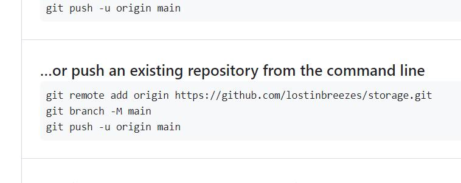
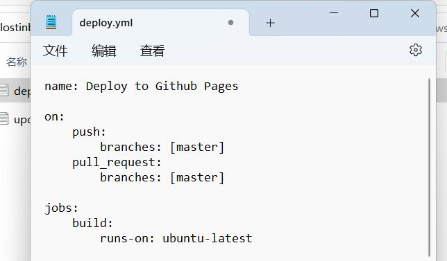

写了两年的blog，因为一些不可抗力挂了。只有为数不多的几篇做了备份，遂转战GitHub托管静态博客。这近一年玩了玩Hexo、Jekyll和Hugo，感觉还是Hugo爽，渲染速度飞起。主题少，看这个Stack还挺好就试了试，结果踩了一堆坑，**而且这货的官方文档就是一坨答辩**，相对来说用户也少一些，踩坑了也搜不到解决办法。

首先不推荐用他的快速模板，总是出bug。还是老实一点clone到本地，`git clone https://github.com/CaiJimmy/hugo-theme-stack/ themes/hugo-theme-stack`，对`config`进行修改后push到GitHub仓库。**这里有一个大坑**：

GitHub默认push的是`main`分支：

而Stack触发分支是`master`分支：

若不将此处`master`改为`main`工作流是无法正常运行的。设置了`main`分支后工作流会自动创建一个`gh_page`分支，在设置里将GitHub Page设置为来自`gh_page`分支即可正常展示。

接着是评论区，默认的是disqus，由于一些众所周知的原因在大陆是无法访问的。在`params.toml`中似乎可以配置 其他评论插件，还没有仔细研究。一定要用disqus的话也可以使用disqusjs，或者用国外的vps写一个很简单的反向代理即可。~~不过相比之下Git talk更符合我的审美，况且本来就是部署在GitHub上的博客，何必再舍近求远呢~~  更新：waline永远滴神( ･´ω`･ )

还有侧边目录又是一个大坑。不仅要在`params.toml`中`[artical]`添加`toc = true`，还需要将`markup.toml`中`unsafe = false`改为`unsafe = true`，否则无法加载html元素。此外，还有`[tableOfContents]`中`startLevel`需要设置为`1`。TAT

待续
