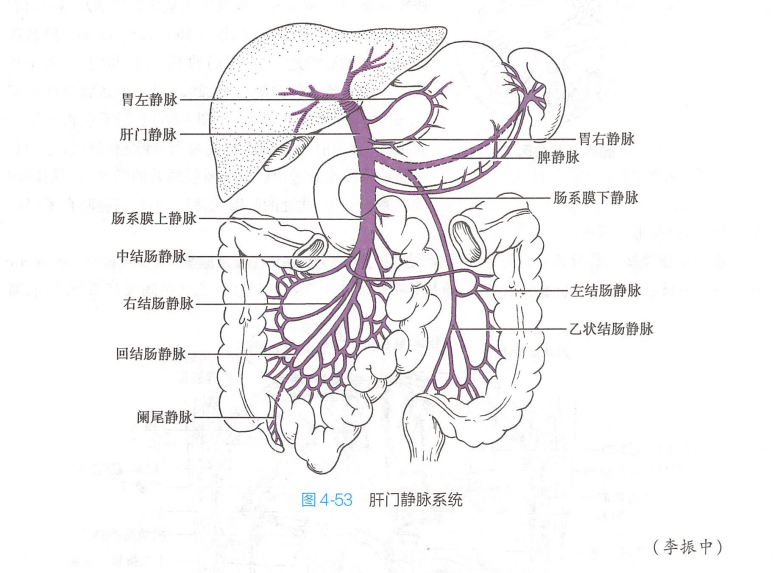
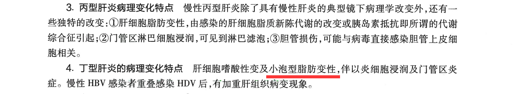
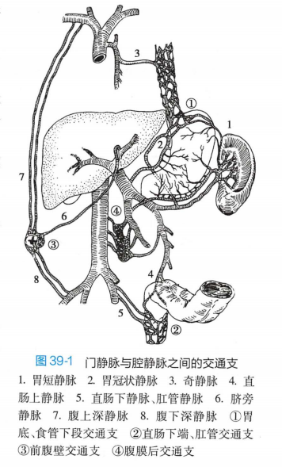

<script type="text/javascript">alert("病理还得看贺银成。贺门！");</script>
<iframe frameborder="no" border="0" marginwidth="0" marginheight="0" width=330 height=86 src="//music.163.com/outchain/player?type=2&id=434902428&auto=0&height=66"></iframe>

# <font color=#ff3030>**考纲**</font>
>***1.慢性胃炎的类型及其病理特点。
2.溃疡病的病因、发病机制、病理特点及其并发症。
3.阑尾炎的病因、发病机制、病理变化及其并发症。
4.病毒性肝炎的病因、发病机制及基本病理变化，肝炎的临床病理类型及其病理学特点。
5.肝硬化的类型及其病因、发病机制、病理特点和临床病理联系。
6.早期食管癌的概念及各型的形态特点，中晚期食管癌各型的形态特点、临床表现及扩散途径。
7.早期胃癌的概念及各型的形态特点，中晚期胃癌的肉眼类型和组织学类型、临床表现及扩散途径。
8.大肠癌的病因、发病机制、癌前病变、肉眼类型及组织学类型，分期与预后的关系，临床表现及扩散途径。
9.原发性肝癌的肉眼类型、组织学类型、临床表现及扩散途径。
10.胰腺炎症及肿瘤性疾病的病因、发病机制及病理特点。***

***

***
# <font color=#ff3030>**慢性胃炎**</font>
## 定义及分类
|||
|:--:|:--:|
|**定义**|胃黏膜的慢性非特异性炎症，发病率高|
|**分类**|非萎缩性胃炎：又称浅表性、单纯性胃炎，好发于胃窦；萎缩性胃炎：分A、B两型|

## 非萎缩性胃炎
|||
|:--:|:--:|
|**好发**|<font color=#eeee00>**胃窦**</font>，病变呈多灶性或弥漫性|
|**肉眼**|胃黏膜充血性水肿，呈淡红色，可伴点状出血糜烂，表面可有灰黄色或灰白色黏液性渗出物覆盖|
|**镜下**|胃黏膜充血水肿，浅表上皮坏死脱落；固有层有<font color=#eeee00>**淋巴细胞、浆细胞**</font>等慢性炎症细胞浸润；腺体保持完整无萎缩性改变|

## 慢性萎缩性胃炎
|||
|:--:|:--:|
|**特点**|胃黏膜萎缩变薄，腺体减少，固有层多量慢性炎细胞浸润|
|**肉眼**|黏膜变薄，皱襞变浅甚至消失，<font color=#eeee00>**黏膜下血管清晰可见**</font>|
|**镜下**|胃黏膜变薄，腺体减少；固有层有多量<font color=#eeee00>**淋巴细胞、浆细胞浸润**</font>，可出现腺上皮化生，其中<font color=#eeee00>**肠上皮化生**</font>比<font color=#eeee00>**假幽门腺化生**</font>更常见；肠上皮化生可见<font color=#eeee00>**细胞不典型增生**</font>|

`2015N167X慢性萎缩性胃炎的病变包括` ABD

```306
A.胃黏膜慢性炎细胞浸润
B.肠上皮化生
C.鳞状上皮化生
D.幽门螺杆菌阳性
```
`2014N133B慢性萎缩性胃炎的主要病变是` D

`2014N134B迷离瘤的病变是` B

```306
A.胃小凹上皮增生
B.胃黏膜内出现胰腺组织
C.胃黏膜浅层糜烂出血
D.胃黏膜腺体变小减少
```
`2008N135B慢性萎缩性胃炎的病变特点` C

`2009N136B慢性浅表性胃炎的病变特点` B

```306
A.胃黏膜内多量中性粒细胞浸润
B.胃黏膜内多量淋巴细胞浸润
C.胃黏膜腺体减少伴肠上皮化生
D.被覆上皮增生导致胃黏膜增厚
```

## <font color=#ff3030>**慢性萎缩性胃炎A型和B型的鉴别**</font>
||A型胃炎|B型胃炎|
|:--:|:--:|:--:|
|**别称**|慢性胃体炎|慢性胃窦炎|
|**累及部位**|胃体、胃底|胃窦|
|**基本病变**|胃黏膜萎缩变薄、腺体减少|胃黏膜萎缩变薄、腺体减少|
|**发病率**|少见|常见|
|**病因**|自身免疫|幽门螺杆菌感染（60%~70%）|
|**恶性贫血**|常有|无|
|**血清VitB<sub>12</sub>水平|降低|正常|
|**IFA（抗内因子抗体）**|阳性（75%）|阴性|
|**PCA（抗胃壁细胞抗体）**|阳性（90%）|阴性|
|**胃酸**|明显降低|中度降低或正常|
|**血清胃泌素水平**|高|低|

`2007N178A伴有恶性贫血的慢性胃炎是` D

```306
A.巨大肥厚性胃炎
B.慢性浅表性胃炎
C.疣状胃炎
D.A型慢性萎缩性胃炎
```

`2007N121B自身免疫性胃炎的胃酸分泌` A

`2007N122B多灶萎缩性胃炎的胃酸分泌` B

```306
A.缺乏
B.正常或减少
C.少量增加
D.明显增加
```
***

# 消化性溃疡
## 病因和发病机制
|||
|:--:|:--:|
|**幽门螺杆菌感染**|在消化性溃疡的发病中具有重要作用|
|**黏膜抗消化能力下降**|黏膜组织被<font color=#eeee00>**胃酸、胃蛋白酶消化**</font>|
|**胃液的消化作用**|胃液对胃壁组织的<font color=#eeee00>**自我消化**</font>|
|**功能失调**|神经内分泌功能失调致精神紧张、胃液分泌障碍|
|**遗传因素**|家族聚集性发病|

## 病理变化
### 胃溃疡
#### 肉眼观
|||
|:--:|:--:|
|**部位**|好发于<font color=#eeee00>**胃小弯侧**</font>，以<font color=#eeee00>**胃窦部**</font>多见|
|**病理改变**|溃疡常为一个，圆形或椭圆形，直径多小于2cm；边缘整齐底部平坦，可穿越黏膜下层深达肌层甚至浆膜层；周围黏膜皱襞因瘢痕组织牵拉呈放射状向溃疡集中|

#### 镜下观
|||
|:--:|:--:|
|**炎症层**|为最表层，以<font color=#eeee00>**嗜中性粒细胞**</font>为主的炎症细胞浸润|
|**坏死组织层**|由一薄层纤维素性渗出物、坏死的细胞碎片覆盖|
|**肉芽组织层**|新鲜的肉芽组织|
|**瘢痕组织层**|肉芽组织形成陈旧的<font color=#eeee00>**瘢痕组织**</font>，底部有<font color=#eeee00>**增殖性动脉内膜炎**</font>，小动脉管壁增厚、管腔狭窄或有<font color=#eeee00>**血栓形成**</font>，造成局部供血不足，妨碍再生，溃疡不易愈合|

### 十二指肠溃疡
|||
|:--:|:--:|
|**部位**|好发于球部前壁或后壁|
|**特点**|溃疡一般较小，直径多小于1cm，溃疡较浅且易愈合|

`2013N166X胃溃疡的镜下病理特征` ACD

```306
A.纤维蛋白和中性粒细胞渗出
B.肉芽肿形成
C.纤维瘢痕形成
D.闭塞性动脉内膜炎
```

`2007N45A下列关于消化性溃疡形态特征的叙述错误的是` D

```306
A.表层以伊红色坏死组织和炎性渗出为主
B.坏死组织下是大量新生毛细血管和成纤维细胞
C.底层瘢痕内可见闭塞性动脉内膜炎
D.溃疡周围见大量异型细胞增生
```

`2019N151X消化性溃疡好发部位` AC

```306
A.十二指肠球部
B.十二指肠升部
C.胃窦部小弯侧
D.胃窦部大弯侧
```
### 结局和并发症
||发生率|原因|
|:--:|:--:|:--:|
|**出血**|<font color=#eeee00>**10%~35%**</font>|溃疡底部毛细血管或大血管破裂|
|**穿孔**|5%|十二指肠溃疡因肠壁较薄更易穿孔|
|**幽门狭窄**|3%|由于瘢痕收缩可引起幽门狭窄|
|**恶变**|<font color=#eeee00>**<1%**</font>|十二指肠溃疡几乎不发生癌变|

`2015N143B消化性溃疡最常见并发症` B

`2015N144B十二指肠溃疡不易发生的并发症` D

```306
A.穿孔
B.出血
C.幽门梗阻
D.癌变
```

`2022N150X消化性溃疡发生游离性穿孔的常见部位` AB

```306
A.胃小弯
B.十二指肠球部前壁
C.胃大弯
D.十二指肠球部后壁
```
***

# 阑尾炎
## 病因和发病机制
|||
|:--:|:--:|
|**阑尾腔阻塞**|有50%~80%的阑尾炎病例伴阑尾腔的阻塞，病理学常见阻塞物为粪石；外科学最常见原因为淋巴滤泡增生|
|**细菌入侵**|大肠杆菌、肠球菌、链球菌非特异性感染|

## 病理变化
|||
|:--:|:--:|
|**急性阑尾炎**|早期：单纯性阑尾炎；中期：蜂窝织炎性阑尾炎；晚期：坏疽性阑尾炎|
|**慢性阑尾炎**|多由急性阑尾炎转变而来，表现为阑尾壁的不同程度纤维化、慢性炎细胞浸润|
|**急性阑尾炎并发症**|急性弥漫性腹膜炎、阑尾周围脓肿、阑尾系膜静脉炎、肝脓肿|

***

# <font color=#ff3030>**病毒性肝炎**</font>
## <font color=#ff3030>**病因和发病机制**</font>
||病毒|病毒性质|传染途径|转为慢性肝炎概率|爆发性肝炎概率|
|:--:|:--:|:--:|:--:|:--:|:--:|
|**甲肝**|HAV|单链RNA|肠道|<font color=eeee00>**无**</font>|0.1%~0.4%|
|**乙肝**|HBV|<font color=eeee00>**DNA**</font>|密接；血液|5%~10%|<1%|
|**丙肝**|HCV|单链RNA|同乙肝|>70%|极少|
|**丁肝**|HDV|<font color=eeee00>**缺陷性RNA**</font>|同乙肝|共同感染<5%；重叠感染>80%|共同感染3%~4%|
|**戊肝**|HEV|单链RNA|肠道|<font color=eeee00>**无**</font>|合并妊娠者20%|
|**庚肝**|HGV|单链RNA|血液|<font color=eeee00>**无**</font>|不详|

## <font color=#ff3030>**病理变化**</font>

### 基本病变
|||
|:--:|:--:|
|**变质**|各型病毒性肝炎病变基本相同，以肝细胞<font color=eeee00>**变性坏死**</font>为主；<font color=eeee00>**水样变性**</font>（细胞肿胀）→气球样变→<font color=eeee00>**溶解坏死**</font>（即液化性坏死，最常见）；<font color=eeee00>**嗜酸性变**</font>→嗜酸性坏死（<font color=eeee00>**凋亡**</font>）；<font color=eeee00>**脂肪变性**</font>→无脂肪坏死（仅丙肝可脂肪样变<font color=#1e90ff>**<sup>1</sup>**</font>）|
|**渗出**|以淋巴细胞、单核细胞浸润多见|
|**增生**|肝细胞增生；间质增生性反应：Kupffer细胞（即肝巨噬细胞）、间叶细胞、成纤维细胞增生；小胆管增生；纤维化|

><font color=#1e90ff>**<sup>1</sup>仅丙肝可见**</font>：9版病理学P219指出，<font color=#ff3030>**丁肝**</font>亦可见。



### 肝细胞变性
|||
|:--:|:--:|
|**细胞水肿（最常见）**|光镜：肝细胞明显肿大，胞质疏松半透明，<font color=eeee00>**气球样变**</font>；电镜：<font color=eeee00>**线粒体**</font>明显肿胀，<font color=eeee00>**内质网**</font>扩张，溶酶体增多|
|**嗜酸性变**|一般仅累及单个或数个肝细胞，散在于肝小叶内，镜下见肝细胞脱水，体积变小，胞质嗜酸性增强（红染）；核染色深|
|**脂肪变性**|肝细胞胞质内出现大小不等的球型脂滴|

### 肝细胞坏死凋亡
#### <font color=#ff3030>**溶解坏死**</font>
|类型|定义|见于|
|:--:|:--:|:--:|
|**点状坏死**|散在分布的单个或数个肝细胞坏死|急性普通型肝炎|
|**碎片状坏死**|肝小叶周边部<font color=eeee00>**界板**</font>肝细胞的灶性坏死崩解，是慢性肝炎的<font color=eeee00>**特征性病变**</font>|慢性肝炎|
|**桥接坏死**|<font color=eeee00>**中央静脉与门管区之间**</font>、两个门管区之间或两个中央静脉间出现的相互连接的坏死带|较重慢性肝炎|
|**亚大块坏死**|肝细胞坏死占<font color=eeee00>**肝小叶**</font>大部分|重型肝炎|
|**大块坏死**|肝细胞坏死几乎占据整个肝小叶|重型肝炎|

#### 凋亡（嗜酸性坏死）
|||
|:--:|:--:|
|**定义**|由嗜酸性变发展而来，胞质浓缩，核浓缩消失，形成深红色浓染的圆形小体，称<font color=eeee00>**嗜酸性小体（凋亡小体）**</font>|
|**镜下**|细胞皱缩，嗜酸性，核固缩|
|**意义**|凋亡是单个肝细胞生理性死亡，见于普通型肝炎|

#### 其它改变
|||
|:--:|:--:|
|**炎症细胞浸润**|淋巴、单核细胞浸润于肝细胞坏死区或门管区|
|**肝细胞再生**|坏死的肝细胞由周围肝细胞再生修复|
|**间质反应性增生**|Kupffer细胞、间叶细胞、成纤维细胞增生|
|**小胆管增生**|慢性且坏死较重的病例，可见小胆管增生|
|**纤维化**|可致肝硬化|

`2005N46A肝细胞点状坏死的特点` D

```306
A.肝细胞核碎裂为小点状的坏死
B.破坏界板的坏死
C.形成嗜酸性坏死
D.坏死灶仅累及几个细胞
E.伴有严重脂肪变性的坏死
```

`2018N36A肝细胞碎片样坏死的形态学改变` C

```306
A.坏死细胞核碎裂
B.肝小叶内肝细胞广泛点状坏死
C.坏死突破界板向肝小叶内扩散
D.肝细胞坏死超过1/3造成肝小叶结构不完整
```

`2014N44A下列肝细胞坏死中属于凋亡的` D

```306
A.碎片状坏死
B.点状坏死
C.桥接坏死
D.嗜酸性坏死
```

`2011N55A下列肝细胞坏死中可以完全经过再生修复的` B

```306
A.大块坏死
B.点状坏死
C.桥接坏死
D.碎片坏死
```

`1997N149X病毒性肝炎中常见的肝细胞病变` ABCD

```306
A.胞浆疏松化
B.气球样变
C.嗜酸性坏死
D.溶解坏死
```

### <font color=#ff3030>**各型病毒性肝炎的病变特点**</font>
#### 甲肝
|||
|:--:|:--:|
|**变性坏死**|肝细胞<font color=eeee00>**气球样变**</font>（最常见）、<font color=eeee00>**嗜酸性变**</font>、嗜酸性小体形成；肝小叶中央静脉周围肝细胞<font color=eeee00>**溶解性坏死**</font>|
|**炎细胞浸润**|门管区单核、淋巴细胞浸润|
|**间质增生**|Kupffer细胞增生|

#### 乙肝
|||
|:--:|:--:|
|**特征**|<font color=eeee00>**毛玻璃样细胞**</font>，肝细胞胞质含<font color=eeee00>**<ruby>HBsAg<rp>(</rp><rt>乙肝表面抗原</rt><rp>)</rp></ruby>**</font>|
|**光镜**|HBsAg携带者及慢性肝炎患者肝细胞体积较大，胞质内充满嗜酸性细颗粒物质，胞质不透明似毛玻璃样|
|**电镜**|<font color=eeee00>**光面内质网**</font>增生，其内有较多HBsAg颗粒|
|**砂粒**|核内大量<font color=eeee00>**<ruby>HBcAg<rp>(</rp><rt>乙肝核心抗原</rt><rp>)</rp></ruby>**</font>形成<font color=#eeee00>**砂粒样细胞核**</font>，表示HBV复制活跃|

`2017N35A引起肝细胞毛玻璃样变的病原体是` B

```306
A.HAV
B.HBV
C.HCV
D.HEV
```

`2017N149X毛玻璃样肝细胞的特点` BCD

```306
A.胞浆内含淀粉样物质
B.胞浆内含HBsAg阳性物质
C.胞浆不透明似毛玻璃样
D.胞浆内充满嗜酸性细颗粒物质
```

#### 丙肝
|||
|:--:|:--:|
|**脂肪变性**|肝细胞<font color=#eeee00>**脂肪变性**</font>明显，但不引起脂肪坏死|
|**淋巴滤泡**|门管区淋巴细胞浸润，可见<font color=#eeee00>**淋巴滤泡**</font>|
|**胆管损伤**|可能与病毒直接感染胆管上皮细胞有关|

`2013N167X丙肝除了一般病毒性肝炎的特点外相对特异的镜下特点` CD

```306
A.碎屑样坏死
B.凋亡小体
C.汇管区淋巴滤泡形成
D.肝细胞脂肪变性明显
```

#### 其他病毒性肝炎
|||
|:--:|:--:|
|**丁肝**|肝细胞嗜酸性变、脂肪变性（偶见）；炎细胞浸润门管区；慢性<font color=eeee00>**HBV**</font>感染者<font color=eeee00>**重叠感染**</font>HDV后加重肝组织病变|
|**戊肝**|门脉区炎症：大量Kupffer细胞、多形核白细胞，淋巴细胞少见；胆汁淤积：肝细胞、毛细胆管胆汁淤积；肝细胞坏死：灶状、小片状、亚大块、大块坏死|
|**庚肝**|急性肝炎：肝细胞肿胀、门管区炎症为主；慢性肝炎：肝细胞肿胀、点状坏死、门管区炎、纤维组织增生|

### <font color=FF3030>**临床病理特点**</font>
#### 分类
||急性普通型|慢性普通型|急性重型|亚急性重型|
|:--:|:--:|:--:|:--:|:--:|
|**坏死类型**|<font color=eeee00>**点状坏死**</font>|<font color=eeee00>**点状、碎片状、桥接坏死**</font>|<font color=eeee00>**大块坏死**</font>|<font color=eeee00>**亚大块坏死**</font>|
|**再生**|完全再生|少量再生|不明显|结节状再生|
|**炎性浸润**|轻度|慢性炎细胞浸润|大量|明显|
|**肝脏变化**|肿胀质软|无变化或略增大|明显缩小|缩小|
|**肝脏被膜**|紧张|稍紧张|皱缩|皱缩|

`2001N101B急性重型肝炎的病理学特点` E

`2001N102B急性普通型肝炎的病理学特点` A

```306
A.肝细胞点状坏死
B.肝细胞碎片状坏死
C.肝细胞桥接坏死
D.肝细胞亚大片坏死
E.肝细胞大片坏死
```

`2016N48A下列病理变化中属于急性普通型肝炎的是` D

```306
A.汇管区炎症并突破界板
B.桥接坏死伴小叶结构破坏
C.肝细胞广泛脂肪变性伴嗜酸性粒细胞浸润
D.肝细胞广泛水肿斑点状坏死
```

`1999N147X急性重型肝炎的病理特点是` BCD

```306
A.肝细胞点状坏死
B.肝体积明显缩小
C.肝质地柔软呈黄色或红褐色
D.肝细胞再生不明显
```

`2021N32A急性重型肝炎残留少量肝细胞，多见的部位是` B

```306
A.中央静脉周围
B.肝小叶周边
C.全小叶随机分布
D.残留的网状支架旁
```

`2020N151X亚急性重型肝炎的病理特点` ABD

```306
A.肝细胞亚大块坏死
B.肝细胞再生结节形成
C.残存肝细胞出现明显异型
D.网状纤维支架塌陷
```

##### 慢性普通型肝炎的分型
||轻度|中度|重度|
|:--:|:--:|:--:|:--:|
|**变性坏死**|轻|明显|严重|
|**坏死类型**|多为<font color=eeee00>**点状坏死**</font>、轻度<font color=eeee00>**碎片状坏死**</font>|中度<font color=eeee00>**碎片状坏死**</font>、特征性<font color=eeee00>**桥接坏死**</font>|重度<font color=eeee00>**碎片状坏死**</font>、大范围<font color=eeee00>**桥接坏死**</font>|
|**肝小叶**|结构清晰，界板无坏死|小叶结构大都保存，内有纤维间隔形成|小叶结构不规则，纤维间隔分割肝小叶|
|**再生**|完全再生|较明显再生|坏死区不规则再生|

`2006N115B急性重型肝炎的特征性病变` E

`2006N116B中度慢性肝炎的特征性病变` C

```306
A.点状坏死
B.桥接坏死
C.碎片状坏死伴桥接坏死
D.亚大片坏死
E.大片坏死
```

***
# 肝硬化
## 类型
|||
|:--:|:--:|
|**病因分型**|肝炎、酒精性、胆汁性、淤血性|
|**曾用分型**|门脉性、坏死后性、胆汁性|
|**国际分型**|小结节性：结节大小相仿，直径<3mm，纤维间隔较细；大结节性：结节粗大，大小不均，直径>3mm，纤维间隔较宽；混合结节性：各占一半|

## 病因
|||
|:--:|:--:|
|**病毒性肝炎**|由<font color=#eeee00>**乙肝、丙肝**</font>引起，占77%，我国以乙肝最常见|
|**酒精性**|欧美占50%~90%，酒精性肝硬化可见<font color=#eeee00>**Mallory小体**</font>|
|**胆汁淤积**|肝内、外胆道阻塞，持续胆汁淤积，可致胆汁性肝硬化|
|**药物毒物**|长期服用损肝药物、接触有毒物质（<font color=#eeee00>**四氯化碳**</font>、磷）|
|**代谢障碍**|铜代谢紊乱可致肝豆状核变性以至肝硬化|
|**营养障碍**|长期营养不良、肥胖、糖尿病致脂肪肝，发展为肝硬化|
|**其他**|血吸虫性肝硬化、Budd-Chiari综合征、淤血性肝硬化|
|**原因不明**|隐源性肝硬化|

`1998N44A最常导致肝硬化的DNA病毒是` B

```306
A.HAV
B.HBV
C.HCV
D.HDV
E.HEV
```

`2014N55A下列肝细胞病变中与肝硬化形成最相关的是` B<font color=#1e90ff><sup>**2**</sup></font>

```306
A.大块坏死
B.桥接坏死
C.灶状坏死
D.碎片样坏死
```

><font color=#1e90ff>**<sup>2</sup>9版教材无此表述**</font>：<font color=#ff3030>**桥接坏死**</font>与<font color=#ff3030>**肝硬化**</font>关系最密切见于2版8年制病理学P274

## 发病机制
|||
|:--:|:--:|
|**胶原纤维增生**|长期反复弥漫性肝损伤可致肝内广泛胶原纤维增生|
|**肝细胞再生**|肝细胞坏死可启动肝细胞再生|
|**假小叶形成**|再生的肝细胞不能沿原有支架排列，形成不规则结节；增生的胶原纤维伸展分隔肝小叶形成假小叶，是<font color=eeee00>**特征性病变**</font>|
|**肝硬化形成**|肝细胞反复坏死再生最终形成弥漫全肝的假小叶，导致肝内血液循环改建、肝功能障碍而形成肝硬化|

## 病理变化
### 肉眼观

<table border=“0”>
	<tr>
		<th></th>
		<th align="center">小结节性肝硬化</th>
		<th align="center">大结节性肝硬化</th>
	</tr>
	<tr>
        <th align="center"><b>特点</b></th>
		<th align="center">肝细胞坏死范围小，分布均匀；肝细胞再生结节小且均匀；纤维间隔较细</th>
		<th align="center">肝细胞坏死范围大，分布不均；肝细胞再生结节较大且大小不均；纤维间隔较宽，宽窄不一</th>
	</tr>
	<tr>
        <th align="center"><b>病因</b></th>
		<th align="center">轻型肝炎、慢性酒精中毒</th>
		<th align="center">重型肝炎、中毒性肝炎</th>
	</tr>
	<tr>
        <th align="center"><b>早期</b></th>
		<th colspan="2" align="center">肝体积正常或稍增大，质地正常或稍硬</th>
	</tr>
	<tr>
        <th align="center"><b>晚期</b></th>
		<th colspan="2" align="center">肝体积缩小，质硬，表面结节状</th>
	</tr>
</table>

### 镜下观
|||
|:--:|:--:|
|**特征**|广泛增生的纤维组织包裹肝细胞结节，称为<font color=eeee00>**假小叶**</font>|
|**病变**|正常肝小叶结构破坏，被假小叶取代；假小叶内肝细胞排列紊乱，再生肝细胞体积大，核大深染；中央静脉缺如、偏位或有两个以上；纤维间隔内可有炎细胞浸润；纤维间隔内小胆管增生|

`2009N56A下列关于肝硬化的病变中符合假小叶的是` C

```306
A.肉眼下见肝内大小不等的结节
B.再生的肝细胞形成的结节
C.广泛增生的纤维组织包绕的肝细胞结节
D.异型增生肝细胞形成的结节
```

`1996N150X肝硬化的病理组织学变化有` ABD

```306
A.假小叶形成
B.纤维组织增生
C.肝细胞弥漫大片坏死
D.淋巴细胞浸润
```

## 临床病理联系
### 门脉高压症的病因
|||
|**窦性阻塞**|肝内广泛结缔组织增生，肝血窦闭塞、门静脉循环受阻|
|**窦后性阻塞**|假小叶压迫小叶下静脉，使肝窦内血液流出受阻，影响门静脉血流入肝血窦|
|**窦前性阻塞**|肝内肝动脉与门静脉小分支在汇入肝血窦前形成异常吻合，使高压力的动脉血流入门静脉内|

### 门脉高压症的症状和体征
|||
|:--:|:--:|
|**淤血性脾大**|70%~85%出现脾大，镜下见脾窦扩张，窦内皮细胞增生|
|**腹水**|①门静脉高压使门静脉系统小静脉和毛细血管流体静压上升，通透性增加，水、电解质和血浆蛋白<font color=#eeee00>**漏入**</font>腹腔；②门静脉高压使肝血窦压力增加，淋巴液从淋巴管漏入腹腔；③肝脏受损后肝细胞合成白蛋白减少，腹水形成；④肝功能障碍导致醛固酮和<ruby>ADH<rp>(</rp><rt>抗利尿激素</rt><rp>)</rp></ruby>灭活减少，致继发性水钠潴留|
|**侧支循环**|门腔静脉之间有4个交通支，以食管下段交通支最重要|
|**胃肠淤血**|腹胀、食欲减退|



### 肝功能障碍
|||
|:--:|:--:|
|**蛋白质合成障碍**|肝合成白蛋白减少，血浆白蛋白减少，白/球蛋白减少|
|**出血倾向**|肝合成凝血因子减少，致皮肤黏膜和皮下出血|
|**胆色素代谢障碍**|毛细胆管淤胆，<font color=eeee00>**肝细胞性黄疸**</font>|
|**灭活作用减弱**|雌激素灭活减少，睾丸萎缩、男乳发育、<font color=eeee00>**蜘蛛痣**</font>、<font color=eeee00>**肝掌**</font>|
|**肝性脑病**|肝功能极度衰竭的表现，为毒性物质未经肝细胞代谢解毒进入体循环所致|

`2018N148X下列选项中与肝硬化腹水生成机制相关的有` AD<font color=#1e90ff><sup>**3**</sup></font>

```306
A.门静脉高压
B.肝脏处理胆红素功能下降
C.肝内纤维组织增生压迫肝静脉主干
D.淋巴液从肝包膜中外渗
```

><font color=#1e90ff>**<sup>3</sup>C选项错误**</font>：1版病理学教材P246表述为：<font color=#40e0d0>**肝内纤维组织**</font>增生，压迫<font color=40e0d0>**小叶下静脉**</font>可致<font color=#ff3030>**肝窦压力增高**</font>，液体漏出，经<font color=#40e0d0>**肝包膜**</font>漏入腹腔，形成腹水。

`2021N152X有门脉高压症导致的病理表现包括` ABD

```306
A.淤血性脾大
B.胃底食管静脉曲张
C.蜘蛛状血管痣
D.胃肠淤血、水肿
```

# 食管癌
## 早期食管癌和中晚期食管癌的比较
||早期食管癌|中晚期食管癌|
|:--:|:--:|:--:|
|**好发**|<font color=eeee00>**中段**</font>>下段>上段<font color=#1e90ff><sup>**4**</sup></font>|同左|
|**定义**|侵犯黏膜或黏膜下层的癌，未侵犯肌层，<font color=eeee00>**无论是否有淋巴结转移**</font>|穿破黏膜下层，侵犯肌层|
|**临床表现**|无明显症状|进行性吞咽困难|
|**肉眼观**|黏膜轻度糜烂，表面呈颗粒状、微小乳头状|髓质型（<font color=eeee00>**最多见**</font>)、蕈伞形、溃疡型、缩窄型|
|**镜下观**|绝大多数为<font color=eeee00>**鳞癌**</font>|<font color=eeee00>**鳞癌**</font>（90%）、腺癌、燕麦小细胞癌、腺棘皮癌|

`2007N155A食管癌最多见的发病部位是` C

```306
A.颈段
B.胸部上段
C.胸部中段
D.胸部下段
```

><font color=#1e90ff>**<sup>4</sup>发生部位**</font>：<font color=#ff3030>**普通食管癌**</font>好发于<font color=#40e0d0>**食管中段**</font>，以<font color=#ff3030>**鳞状细胞癌**</font>多见；<font color=#ff3030>**Barrett食管癌**</font>好发于<font color=#40e0d0>**食管下段**</font>，以<font color=#ff3030>**腺癌**</font>最多见。

`1997N41A下列哪一项有关早期食管癌的描述是错误的` E

```306
A.常无明显症状
B可以是黏膜内癌
C.可以是黏膜下癌
D.可以是原位癌
E.可以侵及浅肌层
```

`2014N165X中晚期食管癌的肉眼类型有` BCD<font color=#1e90ff>**<sup>5</sup>**</font>

```306
A.胶样型
B.髓质型
C.溃疡型
D.隆起型
```

><font color=#1e90ff>**<sup>5</sup>隆起型**</font>：<font color=#bdfcc9>**隆起型**</font>即<font color=#bdfcc9>**蕈伞型**</font>，出处未知，9版病理学教材无此表述。

## 扩散途径
|||
|**直接蔓延**|癌组织穿透食管壁向周围组织、器官浸润|
|**淋巴转移**|与食管淋巴引流途径一致：上段癌转移至颈淋巴结、上纵膈淋巴结；中段癌转移至食管旁、肺门淋巴结；下段癌转移至食管旁、贲门旁、腹腔上部淋巴结|
|**血道转移**|常转移至肝、肺|


