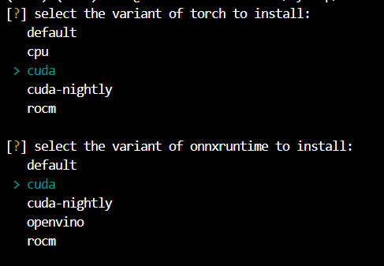
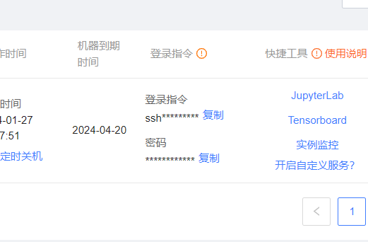
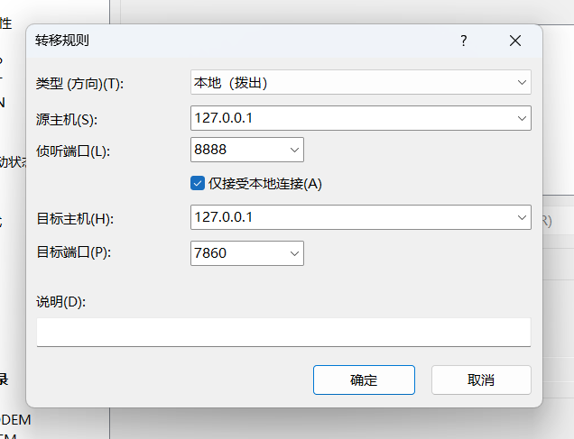
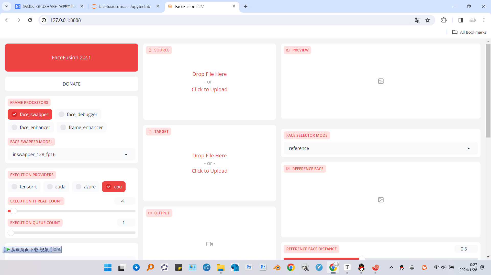

 写在最前面：**有些步骤可能需要魔法**

号称***“Next generation face swapper and enhancer ”***的Facefusion 上周发布了`2.2.1` 版本。虽然对显卡要求没有以前的roop 和deepfake 那么夸张，但是GTX1650 跑起来还是比较吃力，所以决定云端部署。

 这次依然是选择了老朋友恒源云，如果有动手能力也可以尝试白嫖Colab。

 项目地址：https://github.com/facefusion/facefusion

官方文档：https://docs.facefusion.io/

这次创建镜像的时候选择的是`PyTorch` >`2.0.0` >`Cuda11.8.0` 刚好符合项目需求。

 # 一、文件下载
 ```bash
 #安装cli
curl -L https://download.gpushare.com/download/gpushare-cli-linux -o /usr/local/bin/gpushare-cli
chmod u+x /usr/local/bin/gpushare-cli

#验证是否安装成功
gpushare-cli version
 ```
 这一步是为了后续的文件传输，具体可以参考我之前的博客：https://fallen.wang/p/sovits/

然后下载模型文件：***此链接由Bilibili用户 @AI百晓生 提供***

https://pan.baidu.com/s/1U_vsRu9ILHn9FQ_5iph-YQ?pwd=f86f

\*这是为Windows 系统准备的，Linux 只需要下载其中的`models.7z`即可\*

将项目clone 到本地：
```bash
git clone https://github.com/facefusion/facefusion
```
如果因为***众所周知的原因***导致clone 失败，请使用***魔法***，或者自行搭建***异次元通道***，当然也可以下载压缩包到本地手动上传：

```bash
cd /hy-tmp
#上传项目压缩包然后解压
unzip facefusion-master.zip
#创建模型目录，注意以.开头的文件夹是隐藏的
cd facefusion-master
mkdir .assets
#下载模型文件
gpushare-cli baidu down models.7z
#解压，注意文件约6G需要使用7za命令解压
7za x /usr/local/bin/models.7z
#将解压后的models文件夹移动至/.assets内
mv /models /hy-tmp/facefusion-master/.assets
```

 # 二、环境部署
 ## Python
 该项目使用的是`Python3.10` ，而恒源云的Ubuntu 自带的是`Python3.8` ，因此需要升级：
 ```bash
 #更新包列表
 sudo apt update
 #安装依赖项
 sudo apt install -y software-properties-common
 #添加Python3.10 的PPA 到源列表中
 sudo add-apt-repository ppa:deadsnakes/ppa
 #若提示‘Press [ENTER] to continue or Ctrl-c to cancel adding it’则按回车
 #安装Python3.10
 sudo apt install -y python3.10
 #验证
 Python3.10 --version
 ```
## FFmpeg
```bash
apt install ffmpeg
```
若询问是否继续输入`y`

## cURL
```bash
apt install curl
```
若询问是否继续输入`y`

## 虚拟环境
接着创建虚拟环境：

```bash
cd /hy-tmp/facefusion-master
python3.10 -m venv venv
```
此时却出现了这样一条报错：

<font color=#ff3030>Error: Command '['/hy-tmp/venv/bin/python3.10', '-m', 'ensurepip', '--upgrade', '--default-pip']' returned non-zero exit status 1.</font>

此时已经创建了venv ，报错是因为缺少`ensurepip` 模块，具体原因尚不清楚。

```bash
#先把刚刚的venv删掉
rm -rf venv
#重新创建不带pip的venv
python3.10 -m venv --without-pip venv
#激活虚拟环境
source venv/bin/activate
```

# 三、安装项目
```bash
python install.py
```

报错：<font color=#ff3030>ModuleNotFoundError: No module named 'inquirer'</font>
尝试`pip` 却依然报错。

查阅了官方discord后发现也有人遇到过类似问题，版主给出的解决方法是：
```bash
python -m pip install --upgrade pip
```

这时却提示缺少`pip` ，因为刚刚创建虚拟环境的时候留了一个伏笔`--without-pip venv`。手动装一个：
```bash
curl https://bootstrap.pypa.io/get-pip.py -o get-pip.py
python get-pip.py
```
安装了最新版`pip` 之后就可以运行 `install.py`了。

因为显卡是N卡，所以按方向键选择`cuda`,选择两次。
耐心等待脚本执行完毕。
大致看一眼没有报错便可进入下一步。

```bash
python run.py
```
当出现`Running on local URL:  http://127.0.0.1:7860`时即为成功启动了。此时服务器端访问`127.0.0.1：7860`即可，但是毕竟服务器端没有图形化界面，所以可以在`launch()`函数里设置`share=True`以获得可供外网访问的链接：不过我个人更喜欢配置一个端口转发。

以xshell为例，连接至实例时需要提供主机、端口、用户和密码，这些都可以在控制台界面找到。

点击`登录指令`的`复制`按钮，得到如下信息：
`ssh -p 41624 root@i-2.gpushare.com`
其中`41624` 为端口，`root` 为用户，`i-2.gpushare.com` 为主机，密码则单独列出。
新建会话，填写主机和端口，然后在侧边选项卡里找到`SSH` > `隧道`> `添加`，如图示填写：

其中`侦听端口`可随意填写。
以`ROOT` 身份登录，输入密码，成功建立会话后在本地浏览器中输入`127.0.0.1:8888`即可访问web-ui。


BTW，该项目引用了开源的NTFS检测，具体代码位于`/facefusion/content_analyser.py`，可以尝试调整`probability`值。
