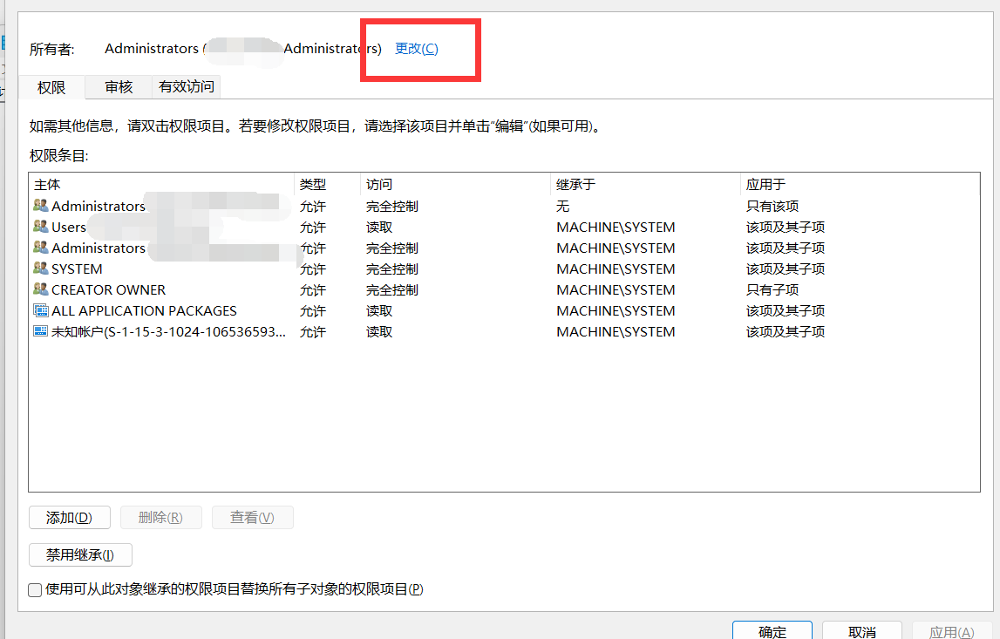

# <font color=#ff3030>**fuck Windows update**</font>

~~***微软的阿三程序员什么时候暴毙啊***~~

每次一开电脑看到这正在更新就烦，而且我是双系统，默认引导的是Linux，更新重启跟难产似的。

百度搜了搜，无外乎那几种互相抄袭的早被微软修复的解决办法，尝试了几个全然无效。~~很符合我对简中互联网粪坑的刻板印象~~

偶然在红迪看到这个方法，[SOLVED How to disable shitty Windows Updates permanently in Windows 10 guaranteed 100% !!](https://www.reddit.com/user/ikashanrat/comments/stsuwr/solved_how_to_disable_shitty_windows_updates/)（<font color=#eeee00>**此链接需要魔法**</font>）标题写的Win 10，经我测试（2023年8月11日）Win 11依然有效

##  免责声明

>禁用Windows自动更新<font color=#ff3030>**可能会让您容易受到安全威胁**</font>,如果您不知道自己在做什么，<font color=#ff3030>**修改注册表可能会导致严重的系统问题**</font>
>
>如果电源中显示<font color=#ff3030>**“更新并关闭”或“更新并重新启动”选项而不是“关闭”和“重新启动”**</font>，请勿尝试此方法。如果是这种情况，请停止“Update Orchestrator Service”、“Windows Update”、“Windows Update Medic Service”这3个服务，然后确认“关机”和“重启”是否恢复。(或者先更新完毕再食用本教程)
>
>该解决方法是<font color=#ff3030>**完全可逆**</font>的，因此如果您决定稍后启用更新，则可以这样做。
>
><font color=#ff3030>**自带的应用商店Microsoft Store 将不再能够连接到互联网（已安装的程序不会受到影响**</font> ，一旦过程逆转，将再次正常

# 操作步骤
## 禁用**UsoSvc**、**WaaSMedicSvc**、**wuauserv**的读写权限

`Win`+`R`呼出运行窗口，输入`regedit`回车运行，在注册表编辑器内找到如下路径：

```Path
计算机\HKEY_LOCAL_MACHINE\SYSTEM\CurrentControlSet\Services\
```

向下滚动找到`UsoSvc`。右键`UsoSvc`，选择`权限`


选择`高级`


选择`更改`



选择`高级`


选择`立即查找`


在下方选择`Administrator`并点击`确定`


选择`确定`


选择下方`禁用继承`


在弹出的对话框选择第二项`从此对象中删除所有已继承的权限`


勾选`使用可从此对象继承的权限项目替换所有子对象的权限项目`


选择`应用`


弹出第一个警告对话框，选择`是`


第二个警告对话框依旧选择`是`


选择下方`确定`


此时所有组或用户均无权访问，选择`确定`


因为无权访问，此时应会报错，选择`确定`即可。


对于同路径下的`WaaSMedicSvc`和`wuauserv`也执行上述操作。

## 验证

`win`+`R`呼出运行，输入`services.msc`打开服务窗口。在`操作`菜单内选择`刷新`


此时，`Windows更新`、`更新Orchestrator服务`和`WaaSMedicSvc`均会在描述中包含错误信息：


重启后再打开服务窗口这三项将不再出现。若在`设置`中打开`Windows更新`窗口，将会显示“出现错误”


至此Windows自动更新已被彻底关闭。如果想恢复自动更新，请参阅上方原贴链接。
