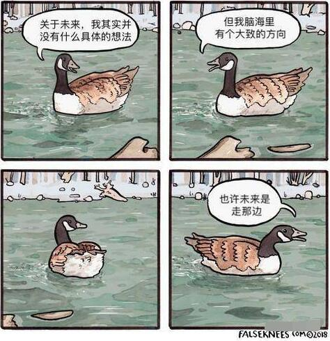

<iframe frameborder="no" border="0" marginwidth="0" marginheight="0" width=330 height=86 src="//music.163.com/outchain/player?type=2&id=65538&auto=1&height=66"></iframe>

前一个博客因为**不可抗力**挂了，到今天也快两年了，抽空搞了个新的。可惜好多文章没有备份，有点对不起曾经关注我支持我的朋友们。仅存的几篇2022年及之前的文章有些还涉及***魔法***之类的敏感技术，现在域名备案了不太方便再放出来 TAT~~（所谓不可抗力其实是vps服务商跑路了......这个故事告诉我们**一定要备份！一定要备份！一定要备份！**）~~

这个博客也基本建设好了，目前的想法是只保留技术性文章，随笔什么的将在不久后迁移到这里：[inspire.fallen.wang]()



接下来准备备考699（生理生化病理诊断外科总论  鲨了我吧😭）大概不能像大一大二时那样腹泻式更新了

如果有空可能会更新这几个方面：

> 神经网络
>
> 基础乐理
>
> python相关
>
> 基础医学的笔记

牙膏要一点一点挤；显卡要一刀一刀切；提琴要一天一天锯，代码要一行一行写。再见咯

> _φ(❐_❐✧ 人丑就要多读书
>
> (为什么颜文字显示不全...)


```python
lingling = 'yes'
hrs = input("Did you practice 40hrs today? (yes/no):")

if hrs == lingling:
    print("Bravo")
else:
    print("Go practice")
```

  
