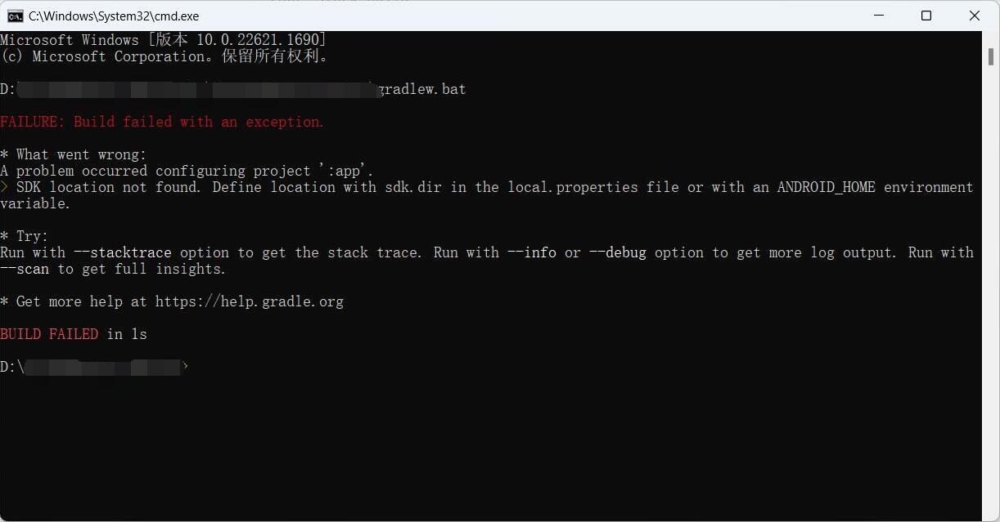

感悟：

> ①**<font color=#ff0000>简</font><font color=#ffa3c7>中</font><font color=#b5a3a7>互</font><font color=#f00fff>联</font><font color=#3d9142>网</font><font color=#4169e1>社</font><font color=#7fff00>区</font><font color=#ffd700>就</font><font color=#802a2a>是</font><font color=#4169e1>一</font><font color=#40e0d0>个</font><font color=#fff500>粪</font><font color=#33a1c9>坑</font>**
>
> ②**Fuck CSDN**
>
> ③**Fuck Baidu**

~~百度你就吃烂钱吧  迟早倒闭 还有csdn  呕  屏蔽csdn 人人有责~~

~~许多问题去bing 上搜索效率能提高十倍  会魔法的直接去谷歌和Stack Overflow  这不比粪坑里淘金舒服？~~

---

在GitHub 上看到一个比较有意思的开源项目，但是只有源码没有`release `，所以`clone `到本地尝试运行`gradlew.bat` 编译。命令行一闪而过，还没看清报错信息就没了。之前没有接触过gradle ,粪坑里搜了半天全是csdn 互相抄的不知所云的🐶💩，最后在某小众论坛看到有人提了一嘴，要在命令行中运行。

`cd ` 到项目目录再运行，果不其然又报错了：

瞄了一眼项目目录似乎没有`local.properties ` ，那就新建一个。查了一下要在这个文件中声明SDK 的路径。

```java
sdk.dir= C:\Users\用户名\AppData\Local\Android\Sdk
```

再次运行，依然报错：

这次的报错很明了：我们声明的SDK 的路径与报错中的路径不符，添加转义符即可。

```java 
sdk.dir= C\:\\Users\\Joe\\AppData\\Local\\Android\\Sdk
```

再次运行批处理即可。

然而此时还未能构建出apk 安装包，

```shell
#清理build文件夹
gradlew clean
#打包
gradlew assembleRelease
```

报错：`Error:Unable to start the daemon process.`

这时需要修改`gradle.properties ` 中`org.gradle.jvmargs=-Xmx1536m ` 一项，参数设置为`1024` 。


继续运行，继续报错。`Could not find tools.jar`

第一想法是Java环境变量没配置好。添加系统变量`JAVA_HOME` ，值设定为Java根目录并编辑`PATH` 变量，依然报错。于是点进Java目录一看，好家伙根本没有`tools.jar` ，甚至没有`jdk` ，只有`jre` 。之前在其他电脑上安装Java 时改了一些安装设置，结果出现了各种莫名其妙的错误，所以这台电脑上我是以默认设置安装的，却还是出现了这种情况。关于错误原因粪坑里众说纷纭，忽然想到`jdk`  是开发环境而`jre` 是运行环境，或许Java官网有开发工具包什么的。果然，安装了`Java SE Development Kit 8u371` 后解决了这一问题。

在另一个项目中还遇到了`javac错误：找不到或无法加载主类 com.sun.tools.javac.Main`错误，这也是由于`jdk` 安装出错造成的。正确安装并配置环境变量后，在命令行中

```shell
javac -version
```

出现了版本信息即为成功。

此时再次构建即可在`app\build\outputs\apk\release`找到安装包。然而通过`gradlew assembleRelease` 得到的安装包是`app-release-unsigned.apk` 未签名的，无法直接安装，可以用Android Studio，或者手机上使用mt管理器进行签名并安装。也可以在构建时直接使用

```shell
gradle assembleDebug
```

这样生成的是debug调试包，已经签名可以直接安装。
