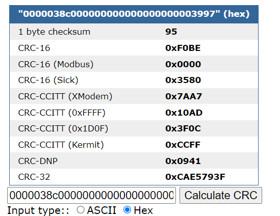

[TOC]

```python
仅供技术交流使用，请勿用于违法用途，否则后果自负！
```


# 前言

本文只针对IC卡下属的Mifare Classic 1k (简称M1卡，目前国内大多数校园卡、公交卡、门禁卡等都在此列)，其包含了16个扇区，每个扇区有0-3共4个块，每块16字节，共1024字节。

**只对离线数据有效！**（例如，充值后需要去激活器上刷卡激活的卡片。部分卡片同时存储了离线数据和在线数据，如即充即用的圈存数据，和充值后需要刷卡激活的水卡数据，则只能修改后者。在线数据存储在服务器中，即使修改了本地缓存也无效）

如何确认自己的卡是否属于M1卡？可以使用带NFC功能的安卓手机进行检测。（参考正文第一段**准备**中的Mifare Classic Tool软件）将卡片紧贴手机，打开软件，选择工具>显示标签信息>若出现如下截图：

标签类型为MIFARE Classic的即为M1卡，其中SAK值为08代表s50型号，18代表s70型号


# 一.准备

·需要准备的硬件：

> 一台有USB接口的计算机
>
> 一部有NFC功能的安卓手机
>
> PN532，某宝上有集成板，约30元
>
> 若干张水卡
>
> 一个健全的大脑

·需要准备的软件：

> PC端：PN532配套软件（链接：https://pan.baidu.com/s/1-FrJKKnw1JbR4lnyaRR22A?pwd=wa2v 提取码：wa2v  解压密码：pn532
>
> 安卓端：Mifare Classic Tool（链接：https://pan.baidu.com/s/11x10vu_GMiNZoJp5igiaHg?pwd=zc0y 提取码：zc0y ）
> 

# 二.读取数据

安装pn532驱动后打开软件，准备若干张水卡。依次点击串口，连接设备，开始解卡，此时软件开始读取数据。


成功破解后当前卡片的数据会在表A中列出。可以看到每个扇区都有4个块，其中0-2块储存数据，3块储存密钥及控制位。


# 三.分析数据

将读取到的数据保存，然后去消费一定数量金额，再次解卡。将上一次保存的数据导入到表B中，然后对比数据。可以发现，只有第10扇区数据发生了变化，因此可以得出结论，金额数据存储在第10扇区。


观察表A和表B前两个块的数据发现，第三、四字节的数据分别为`038A`，`038C`，`038E`，成等差数列。打开计算机自带的计算器，切换到程序员模式，选择十六进制（HEX），输入`038A`，得到对应的十进制数值（DEC）为906。而此时卡里的金额为9.06元，前一次消费时金额9.08也与`038C`对应，基本可以确定前四个字节存储的是金额。由于消费金额较少（0.02），可能会出现如图两块数据只有一块数据改变的情况。金额一旦确定，剩下的便是校验位的问题。为防止篡改，卡片会有一个安全算法，对金额进行加密。由于中间部分没有发生变化，所以可以合理假设最后两个字节为校验位。

一般来说校验位算法比较复杂，可能涉及异或、取反等多种运算，而我们现有的数据太少难以发现规律，因此首先可以考虑克隆。由于掌握了密钥，我们可以对卡里的数据进行复制和更改。消费掉一定金额后，将表A的数据再次刷入，然后观察读卡器，金额又变回了9.06，这一思路是可行的。但是多次以同一金额重复刷卡会导致卡片锁死（惨痛教训），除非本来卡内金额较多可以支撑长时间使用外，我们不得不考虑更改数据。

然而要更改数据必然涉及到校验位算法。前前后后近一年，仍然没有取得实质性进展。然而某一天阅读维修文档时发现，有一类卡片报错是由于<u>CRC校验错误</u>引起的。这给我带来了灵感，我并不需要知道具体的校验算法是什么，只要能得到校验后的数据就行。可以参考这个在线计算CRC的网站：https://www.lammertbies.nl/comm/info/crc-calculation，选择HEX模式，将第一块的数据复制进去，得到`0000038a00000000000000000000271f`的CRC-16校验值为`F0BE`，而第二块数据`0000038c000000000000000000003997`的CRC-16校验值也是`F0BE`。




同理,对表B的数据进行验证，校验值 依然是`F0BE`。也就是说，无论这个神秘的校验算法是什么，最终整个块的CRC-16校验值是不变的，因此我们有了这样一个逆向思路：

> 输入我想要的金额→校验算法对金额加密并输出到最后两字节→整体CRC-16校验值不变，为`F0BE`→穷举最后两字节16×16×16×16＝65536种可能组合，与块中前14个不变字节拼接并分别计算CRC-16校验值→找到校验值同为`F0BE`的组合→其末尾两个字节即为我们需要的校验算法得到的数据

人工计算65536个16字节字符串显然不现实，这里使用Python辅助。C语言和Java同理。

# 四.破解

(由于对CRC并不熟悉，所以代码让ChatGPT写了个模板，自己稍微改了改，这时候就觉得人工智能真牛逼QAQ)


```python
import binascii
import crcmod

# 定义计算CRC16校验值的函数
def crc16(data):
    crc16_func = crcmod.predefined.Crc('crc-16')
    crc16_func.update(data)
    return crc16_func.hexdigest()

# 打开shuju.txt文件并穷举65536个字符串
with open("shuju.txt", "w") as f:
    hex_data = input("请输入16进制数据：")
    for i in range(65536):
        new_data = hex(i)[2:].zfill(4).upper()
        f.write(hex_data + new_data + "\n")

# 打开shuju.txt文件并计算每个字符串的CRC16校验值
with open('shuju.txt', 'r') as f:
    lines = f.readlines()

# 将字符串及其CRC16校验值输出到shuju_crc.txt中
with open('shuju_crc.txt', 'w') as f:
    for line in lines:
        data = binascii.unhexlify(line.strip())
        crc = crc16(data)
        f.write('{} {}\n'.format(line.strip(), crc))

```

例如，将金额设置为100元，在计算器中输入10000，可知对应的16进制数值为`2710`，运行上述代码，输入前14个不变字节`0000271000000000000000000000`，程序将会在末尾加上从`0000`递增到 `FFFF`的字符串，并将这65536个新的字符串输出到`shuju.txt`中。接着对这些数据分别计算CRC-16校验值，并将原始数据和对应的校验值输出到`shuju_crc.txt`中。

由于CRC-16涉及到多项式计算，65536个数据可能对CPU有一定要求，以我为例，穷举过程只用了不到0.5秒，计算CRC则用了约15秒。结束后得到如下数据：


按`crtl`+`F`呼出查找界面，查找`F0BE`应该会有两个结果，一个是作为穷举数据出现在原字符串末尾的；另一个是作为CRC-16计算结果，与原始字符串间隔了一个空格的，我们需要的是后者。如图，看到该字符串结尾是`8BB5`，即`2710`经过神秘校验算法得到的数值为`8BB5`。同理，我们对99.98对应的16进制数据`270E`进行如上操作，得到末尾两字节为`EB9D`。此时我们将`00002710000000000000000000008BB5`和`0000270E00000000000000000000EB9D`刷入第10扇区的前两个块，然后任意消费验证，金额变成了100元。至此M1卡破解完毕。

---

# 五.后续

仅仅是破解了CRC校验并没有让我满足，毕竟至今我还未曾解开校验算法的神秘面纱。以及，每张卡的密钥是不同的，且似乎与卡号有着某种联系。遗憾的是对于异或、取余、取反等运算不够熟悉，且样本量太小，还没能取得实质性进展。先挖个坑吧，将来有机会一定补上。


