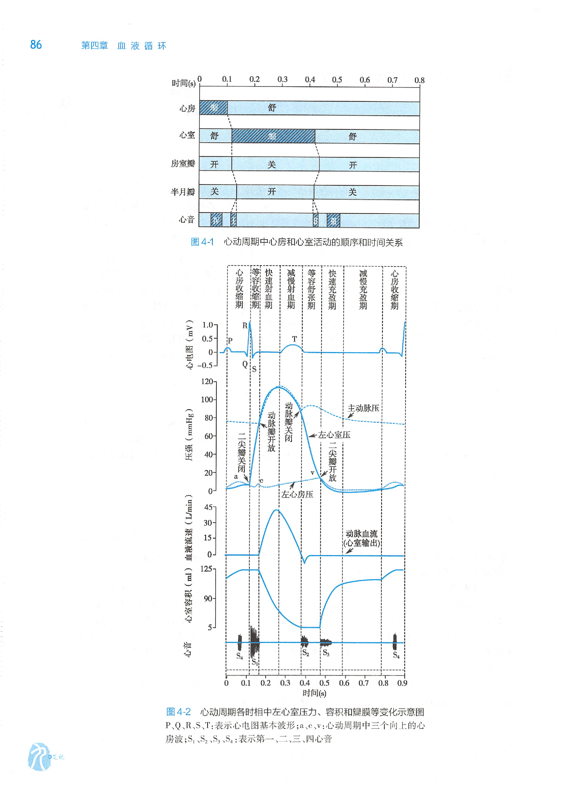

# 血液循环

***

## 一、心动周期



### 判断心动周期阶段

阶段划分：
```306
1993N3A心动周期中从房室瓣关闭到开放的时间相当于：E
A.心房收缩期+心室等容收缩期
B.心房收缩期
C.心室收缩期
D.心室舒张期
E.心室收缩期+等容舒张期
```

各期特点，如动脉压、室内压、心室容积、瓣膜开放或关闭时间、心音的形成：

```306
1994N15A心动周期中在下列哪个时期主动脉压最低：A
A.等容收缩期末
B.等容舒张期末
C.心房收缩期末
D.快速充盈期末
E.减慢充盈期末
```

|     特征      |     时期     |
| :-----------: | :----------: |
| 左心室压力MAX | 快速射血期末 |
|左心室容积MIN|等容舒张期末|
|左心室容积MAX|心房收缩期末|
|主动脉压MAX|快速射血期末|
|主动脉压MIN|等容收缩期末|
|主动脉血流量MAX|快速射血期|
|室内压升高最快|等容收缩期|
|第一心音产生|心房收缩期末（房室瓣关闭）|
|第二心音产生|减慢射血期末（主动脉瓣关闭）|

### 评价心功能的指标

射血分数、心输出量、每搏输出量、心指数、心脏做功量：

```306
2005N6A高血压患者与正常人相比哪项指标明显升高：E
A.每搏输出量
B.射血分数
C.心输出量
D.心指数
E.心脏做功量
```

搏出量即每搏输出量，约60~80ml。影响因素有前负荷、后负荷、心肌收缩能力和回心血量等。

射血分数是搏出量除以心室舒张末期容积。扩心病患者心室舒张末期容积变大，射血分数降低。因此射血分数对早期心脏泵血功能异常具有重要意义。

<font color=#ffff30>**单侧**</font>心室每分钟输出的血液量称为心输出量。数值等于心率乘以搏出量。左右两侧心输出量基本相等。

以单位面积计算的心输出量为心指数。静息心指数用于评价不同个体的心功能。
