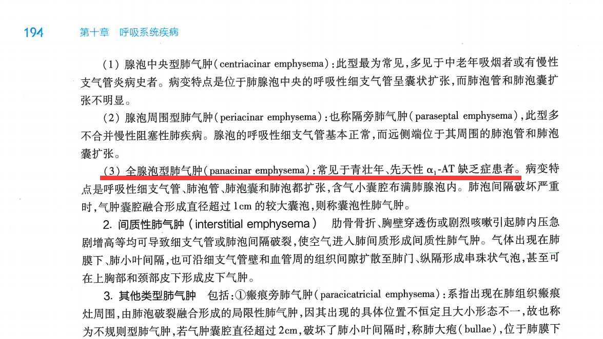
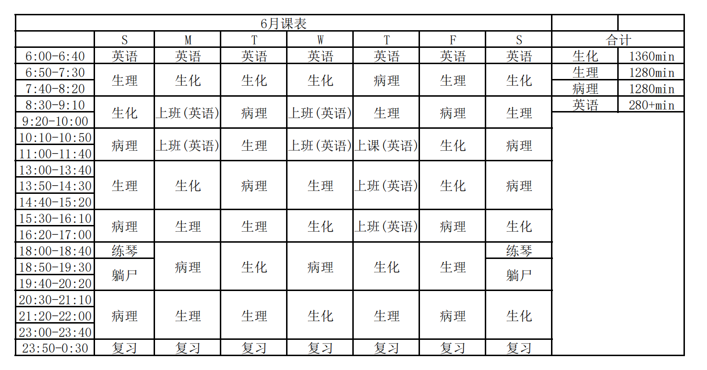

<script type="text/javascript">alert("病理还得看贺银成。贺门！");</script>
<iframe frameborder="no" border="0" marginwidth="0" marginheight="0" width=330 height=86 src="//music.163.com/outchain/player?type=2&id=857896&auto=1&height=66"></iframe>

# <font color=#ff3030 >**考纲**</font>

>***1.慢性支气管炎的病因、发病机制和病理变化。
>2.肺气肿的概念、分类。慢性阻塞性肺气肿的发病机制、病理变化和临床病理联系。
>3.慢性肺源性心脏病的病因、发病机制、病理变化及临床病理联系。
>4.各种细菌性肺炎的病因、发病机制、病理变化和并发症。
>5.支原体肺炎的病因、发病机制、病理变化和并发症。
>6.病毒性肺炎的病因、发病机制和病理特点。
>7.支气管扩张的概念、病因、发病机制、病理变化和并发症。
>8.硅沉着病的病因、常见类型、各期病变特点及并发症。
>9.肺泡性损伤及肺间质性疾病的概念、病因、发病机制和病理变化。
>10.鼻咽癌和肺癌的病因和常见的肉眼类型、组织学类型及它们的特点、转移途径及合并症。***

***
# 慢性支气管炎
## 病因和发病机制
|||
|:--:|:--:|
|**定义**|慢支是支气管黏膜及周围组织慢性非特异性炎性疾病|
|**感染**|慢支的发病与上呼吸道<font color=#EEEE00>**病毒或细菌感染**</font>密切相关|
|**吸烟**|患病率与吸烟量成正比|
|**空气污染**|空气污染与慢支有明显因果关系|
|**内在因素**|机体抵抗力降低、呼吸系统防御功能受损、内分泌失调等|

## 病理变化
|||
|:--:|:--:|
|**黏液-纤毛排送系统受损**|纤毛柱状上皮变性坏死，再生的上皮杯状细胞增多，并发鳞状上皮化生|
|**黏膜下腺体增生**|浆液性上皮发生黏液腺化生，导致黏液分泌增多|
|**管壁**|<font color=#EEEE00>**管壁充血水肿**</font>，<font color=#EEEE00>**淋巴细胞和浆细胞浸润**</font>；管壁平滑肌断裂萎缩；软骨变性萎缩骨化|
|**细支气管炎和细支气管周围炎**|为慢支反复发作的结果，是引起肺气肿的病变基础|

`2020N150X在慢性支气管炎中常见的病变有` ABCD
```306
A.柱状上皮细胞脱落
B.支气管上皮鳞状化生
C.支气管管壁软骨变性萎缩
D.支气管腺体黏液腺化生
```
`2007N138X慢性支气管炎的病理变化可有` ABC
```306
A.柱状上皮的纤毛倒伏甚至完全脱失
B.支气管腺体增生和黏液腺化生
C.支气管管壁中出现大量淋巴细胞
D.支气管管壁软骨出现不典型增生
```
***
# 肺气肿
## 病因和发病机制
|||
|:--:|:--:|
|**定义**|是<font color=#EEEE00>**末梢肺组织**</font>因含气量过多、肺泡间隔破坏、肺组织弹性减弱，导致非体积膨大、通气功能降低的状态|
|**通气障碍**|慢支时呈现典型的阻塞性通气障碍|
|**弹性降低**|长期支气管炎可导致呼吸性细支气管和肺泡壁弹性降低|
|**α<sub>1</sub>-AT缺乏**|遗传性α<sub>1</sub>-抗胰蛋白酶缺乏可导致全腺泡型肺气肿|

`2000N147X慢性阻塞性肺气肿的发生与下列哪些因素有关` ABC<font color=#1e90ff>**<sup>1</sup>**</font>

```306
A.小气道的阻塞性通气障碍
B.内源性弹性蛋白酶增多
C.吸烟
D.遗传性α<sub>1</sub>-抗胰蛋白酶缺乏
```

><font color=#1e90ff>**<sup>1</sup>答案有争议**</font>：按9版病理学P194遗传性α<sub>1</sub>-AT缺乏是<font color=#ff3030>**全腺泡型肺气肿**</font>的病因，但当年医学考试中心给出的参考答案没有D选项。~~可能是因为与内科教材相互矛盾。~~


`1997N45A遗传性α<sub>1</sub>-抗胰蛋白酶缺乏与下列哪种肺气肿的发生关系密切` C
```306
A.小叶中央型肺气肿
B.间质性肺气肿
C.全腺泡型肺气肿
D.肺大疱
E.瘢痕旁肺气肿
```

## 肺气肿的类型
### 肺泡性肺气肿
|||
|:--:|:--:|
|**腺泡中央型**|呼吸性细小支气管扩张；肺泡管、肺泡囊扩张不明显|
|**腺泡周围型**|呼吸性细小支气管正常；<font color=#eeee00>**肺泡管、肺泡囊扩张**</font>|
|**全腺泡型**|呼吸性细小支气管、肺泡管、肺泡囊均扩张|

`2011N52A中央型肺气肿是指` B
```306
A.三、四级支气管和周围肺泡囊扩张
B.呼吸性支气管扩张，周围肺泡扩张不明显
C.肺门周围的肺组织扩张，近胸膜处肺组织扩张不明显
D.呼吸性细支气管扩张不明显，周围肺泡管和肺泡囊扩张
```
`2015N52A腺泡周围型肺气肿的病理表现` A
```306
A.呼吸性细支气管不扩张，周围肺泡扩张
B.呼吸性细支气管扩张，周围肺泡扩张不明显
C.肺泡间隔内出现成串小气泡
D.呼吸性细支气管、肺泡管和肺泡囊均扩张
```

### 其他类型肺气肿
|||
|:--:|:--:|
|**间质性肺气肿**|肋骨骨折、胸壁穿透等致肺内压急剧增高，肺泡间隔破裂，空气进入肺间质|
|**瘢痕旁肺气肿**|<font color=#eeee00>**肺组织瘢痕灶**</font>周围肺泡破裂融合形成的局限性肺气肿；若囊腔过大破坏肺小叶间隔，称<font color=#eeee00>**肺大疱**</font>，肺大疱破裂可致气胸|
|**代偿性肺气肿**|肺萎缩、肺叶切除后残余组织或肺炎性实变病灶周围肺组织的肺泡代偿性过度充气|
|**老年性肺气肿**|老年人肺组织弹力减弱，肺残气量增多|

## 肺气肿的病理变化
|||
|:--:|:--:|
|**肉眼观**|肺体积显著增大，灰白色，质柔软而缺乏弹性，按压痕不易消失|
|**镜下观**|肺泡扩张，肺泡间隔变窄断裂，相邻肺泡融合，间隔内毛细血管床数量减少，间质内肺小动脉内膜纤维性增厚，细小支气管借鉴慢性炎症改变|

***
# 肺源性心脏病
## 病因和发病机制
|||
|:--:|:--:|
|**定义**|各种原因所致的<font color=#EEEE00>**肺动脉高压**</font>→肺循环障碍→右室肥大|
|**肺疾病**|<font color=#EEEE00>**COPD（80%~90%）**</font>、支喘、支扩、肺尘埃沉着症、慢性纤维空洞型肺结核、弥漫性间质性肺纤维化|
|**胸廓疾病**|胸廓畸形、类风湿关节炎、胸膜广泛粘连|
|**肺血管疾病**|原发性肺动脉高压症、反复发生非小动脉栓塞|

`2003N33A慢性肺源性心脏病发生的关键环节是` C
```306
A.肺间质纤维化
B.肺气肿
C.肺动脉高压
D.肺动脉分支血栓栓塞
E.肺阻塞性通气障碍
```
`1998N147X下述哪些疾病可以导致慢性肺源性心脏病` ABCD
```306
A.慢性阻塞性肺气肿
B.三期矽肺
C.慢性空洞性肺结核
D.肺动脉反复血栓栓塞
```

## 病理变化
|部位|病变|
|:--:|:--:|
|**肺部**|<font color=#EEEE00>**无肌型细动脉**</font>肌化；<font color=#EEEE00>**肌型小动脉**</font>中膜增生肥厚、内膜下出现纵行肌束；肺<font color=#EEEE00>**小动脉炎**</font>，肺<font color=#EEEE00>**小动脉**</font>弹力纤维、胶原纤维增生；肺泡间隔毛细血管数量显著减少|
|**心脏**|右室肥厚、心室腔扩大；肺动脉瓣下2cm处右室前壁肌层厚度><font color=#EEEE00>**0.5cm**</font>是肺心病的病理诊断标准；右心室壁心肌细胞肥大；心肌间质水肿、胶原纤维增生|

`2004N138X下列属于慢性肺源性心脏病肺内血管病变的有` ACD
```306
A.毛细血管数量减少
B.中型动脉纤维素样坏死
C.无肌型细动脉肌化
D.肌型小动脉中膜增厚
```
`2014N52A慢性肺源性心脏病的主要指标是` A
```306
A.肺动脉瓣下2cm处右心室壁厚度超过0.5cm
B.左心室肥厚
C.心脏重量增加可达850克
D.三尖瓣关闭不全
```
## 临床病理联系
|||
|:--:|:--:|
|**临床表现**|原有肺疾病的临床症状和体征、呼吸功能不全、右心衰竭|
|**病情严重**|可合并呼吸性酸中毒、脑水肿甚至肺性脑病|

***
# <font color=#ff3030>**细菌性肺炎**</font>
## <font color=#ff3030 >**大叶性肺炎**</font>
### 病因和发病机制
| | |
|:--:|:--:|
|**肺炎链球菌**|占<font color=#EEEE00>**90%**</font>，以1、2、3、7型多见，3型毒力最强|
|**其他病原菌**|肺炎杆菌、金葡菌、流感嗜血杆菌、溶血性链球菌|
|**诱因**|受寒、醉酒、疲劳、麻醉等机体抵抗力降低时|
|**发病机制**|由肺炎链球菌引起的以肺泡内弥漫性<font color=#EEEE00 >**纤维素渗出为主**</font>|

`2016NO137肺炎链球菌感染常引起的病变是`  A
```306
A.纤维素性炎症 
B.化脓性炎症 
C.增生性炎症 
D.浆液性炎症
```

### 病理变化
#### 肉眼观
||充血水肿期|红色肝样变期|灰色肝样变期|溶解消散期|
|:--:|:--:|:--:|:--:|:--:|
|**病程**|发病后1-2天|发病后3-4天|发病5-6天|发病后7天|
|**肉眼观**|肺叶肿胀、充血呈暗红色，挤压切面见淡红色浆液溢出|肺叶肿大加重，质地变硬，切面灰红色，粗糙外观似肝脏|肺叶肿大，实质如肝，灰白色，干燥粗糙|肺开始缩小，质地变软，病灶消失，切面少量浑浊液|

#### 镜下观
||充血水肿期|红色肝样变期|灰色肝样变期|溶解消散期|
|:--:|:--:|:--:|:--:|:--:|
|**肺泡壁CAP**|扩张|扩张|受压贫血|逐渐恢复|
|**肺泡渗出**|浆液性渗出|中量纤维素渗出|大量纤维素渗出|纤维素逐渐溶解|
|**红细胞**|少量|多量|大量溶解|极少|
|**中性粒细胞**|少量|少量|多量|死亡|
|**巨噬细胞**|少量|少量|中量|大量|

#### 并发症
|||
|:--:|:--:|
|**肺肉质变（机化性肺炎）**|<font color=#eeee00>**中性粒细胞过少**</font>，释放的蛋白酶不足以溶解渗出的纤维素，被肉芽组织取代，病变肺组织呈褐色肉样外观<font color=#1e90ff><sup>**2**</sup></font>|
|**胸膜肥厚粘连**|纤维素性胸膜炎不能完全溶解发生机化|
|**肺脓肿、脓胸**|病原菌毒力大、机体抵抗力下降时发生|
|**败血症、脓毒败血症及感染性休克**|见于重症病例|

><font color=#1e90ff>**<sup>2</sup>褐色肉样外观**</font>：区别于<font color=#ff3030>**肺褐色硬化**</font>，<font color=#ff3030>**肺褐色硬化**</font>见于<font color=#ff3030>**慢性肺淤血**</font>，是局部血液循环障碍。

`2009NO48A中性粒细胞渗出过少的大叶性肺炎易发生的并发症是` A

```306
A.肺肉质变  
B.肺脓肿  
C.脓胸  
D.败血症
```
`2022NO31A下列易并发肺肉质变的肺部疾病是` C
```306
A.由化脓菌引起的小叶性肺炎  
B.由病毒引起的间质性肺炎  
C.由肺炎链球菌引起的大叶性肺炎  
D.由肺炎支原体引起的间质性肺炎
```
`2007NO39A肺褐色硬化是下列哪种疾病的形态改变` C
```306
A.特发性肺纤维化
B.机化性肺炎
C.慢性肺淤血
D.大叶性肺炎
```

## <font color=#ff3030 >**小叶性肺炎（支气管肺炎）**</font>
### 病因和发病机制
|||
|:--:|:--:|
|**肺炎链球菌**|致病力较弱的4、6、10型肺炎链球菌是最常见的致病菌|
|**其他病原菌**|葡萄球菌、流感嗜血杆菌、肺炎克雷伯杆菌、铜绿假单胞菌、大肠埃希菌|
|**诱因**|机体抵抗力降低；某些疾病的并发症：<font color=#EEEE00 >**吸入性肺炎**</font>、<font color=#EEEE00 >**坠积性肺炎**</font>、麻疹后肺炎、手术后肺炎|
|**发病机制**|由化脓性细菌引起的以肺小叶为病变单位的<font color=#eeee00>**急性化脓性**</font>炎症|

`2010NO48A吸入性肺炎的病理学类型是` A
```306
A.支气管肺炎
B.大叶性肺炎
C.间质性肺炎
D.弥漫性肺泡损伤
```
### 病理变化和并发症
|||
|:--:|:--:|
|**肉眼**|表面和切面散在分布灰黄质实病灶，以<font color=#EEEE00 >**下叶和背侧**</font>多见，病灶大小不一，形状不规则，<font color=#EEEE00 >**一般不累及胸膜**</font>|
|**镜下**|细支气管黏膜充血水肿；肺泡腔较多<font color=#EEEE00 >**中性粒细胞**</font>浸润|
|**并发症**|呼吸功能不全、心力衰竭、脓毒血症、肺脓肿、脓胸|

## <font color=#ff3030 >**大叶性肺炎和小叶性肺炎的鉴别**</font>
||大叶性肺炎|小叶性肺炎|
|:--:|:--:|:--:|
|**病原菌**|<font color=#EEEE00 >**肺炎球菌（90%）**</font>|葡萄球菌、肺炎球菌等|
|**典型病变**|肺泡到肺段、肺叶|以肺小叶为单位灶性散布|
|**特点**|<font color=#EEEE00 >**支气管不受累**</font>|<font color=#EEEE00 >**胸膜不受累**</font>|
|**好发人群**|青壮年|小儿、年老体弱者|
|**好发部位**|左肺、右肺下叶|双肺下叶、背侧|
|**病理变化**|<font color=#EEEE00 >**纤维素性炎**</font>|<font color=#EEEE00 >**化脓性炎**</font>|

`2021NO124B属于纤维素性炎的是` A

`2021NO125B属于化脓性炎的是` B
```306
A.大叶性肺炎
B.小叶性肺炎
C.支原体肺炎
D.病毒性肺炎
```
`1994NO148X大叶性肺炎的病理特点` ACD
```306
A.肺泡的纤维素性炎
B.支气管常受累
C.可合并中毒性休克
D.可合并肺脓肿
```
***
## 军团菌肺炎
### 病因和发病机制
|||
|:--:|:--:|
|**病因**|军团菌是需氧G<sup>-</sup>杆菌，主要通过空气传播|
|**发病机制**|从呼吸道侵犯肺泡和细支气管，进入胞质繁殖致细胞破裂释放酶类和细胞毒因子，损伤肺组织|

### 病理变化
|||
|:--:|:--:|
|**肉眼**|肺体积增大，质硬，表面粗糙，有<font color=#EEEE00 >**纤维素附着**</font>，病灶切面呈暗灰色片状，晚期可波及多肺叶，严重病例可见<font color=#EEEE00 >**肺脓肿**</font>形成|
|**镜下**|早期以大量<font color=#EEEE00 >**纤维素、中性粒细胞**</font>渗出为主，常伴坏死；晚期坏死组织机化，间质纤维化|

## <font color=#ff3030 >**病毒性肺炎**</font>和<font color=#ff3030 >**支原体肺炎**</font>
### 病因及病理变化
|||
|:--:|:--:|
|**病原体**|常见于<font color=#EEEE00 >**流感病毒**</font>、呼吸道合胞病毒、腺病毒、麻疹病毒|
|**肉眼观**|病变常不明显，肺组织可因充血水肿轻度肿大|
|**镜下观**|主要表现为<font color=#EEEE00 >**间质性肺炎**</font>，肺泡腔内无渗出或少量渗出；肺泡间隔明显变宽，其内血管扩张充血；间质水肿，大量淋巴细胞、单核细胞浸润|
|**特征**|<font color=#EEEE00 >**病毒包涵体**</font>是诊断病毒性肺炎的重要依据，多见于支气管上皮细胞、肺泡上皮细胞、多核巨细胞|

`2017NO34A下列病理改变符合病毒性肺炎的是` B
```306
A.常有肺泡结构破坏
B.肺泡间隔水肿，炎细胞浸润
C.肺泡内常有大量纤维素渗出
D.局部区域中性粒细胞浸润
```

### <font color=#ff3030>**病毒包涵体**</font>
|位置|病原体|
|:--:|:--:|
|**胞核**|腺病毒、单纯疱疹病毒、巨细胞病毒（嗜碱性）|
|**胞质**|呼吸道合胞病毒（嗜酸性）|
|**胞核和胞质**|麻疹病毒|

`1992NO35A病毒性肺炎的主要诊断依据是` C
```306
A.间质性肺炎
B.淋巴细胞、单核细胞为主的炎细胞浸润
C.上皮细胞内病毒包涵体
D.肺泡上皮细胞增生
E.肺泡内透明膜形成
```
`1994NO125C麻疹病毒` C

`1994NO126C腺病毒` A
```306
A.核内病毒包涵体
B.胞质内病毒包涵体
C.两者皆有
D.两者皆无
```

### 支原体肺炎
||病毒性肺炎|支原体肺炎|
|:--:|:--:|:--:|
|**病原体**|流感病毒（<font color=#eeee00 >**最常见**</font>）、呼吸道合胞病毒、腺病毒、麻疹病毒、巨细胞病毒|支原体|
|**病理变化**|<font color=#eeee00 >**间质性肺炎**</font>间质水肿、大量淋巴单核细胞浸润；肺泡腔变小、无或少量浆液渗出<font color=#1e90ff ><sup>**2**</sup></font>|同左|
|**包涵体**|有|无|

><font color=#1e90ff >**<sup>2</sup>根据肺泡腔内有无渗出判断肺炎类型**</font>：
>若渗出物为<font color=#40e0d0 >**纤维素**</font>，则为<font color=#ff3030 >**大叶性肺炎**</font>；渗出物为<font color=#40e0d0 >**中性粒细胞**</font>，为<font color=#ff3030 >**小叶性肺炎**</font>；两者均有，为<font color=#ff3030 >**军团菌肺炎**</font>；无渗出或少量浆液性渗出为<font color=#ff3030 >**病毒性肺炎**</font>或<font color=#ff3030 >**支原体肺炎**</font>。

`2013NO135支原体肺炎的病理类型通常是` C

`2013NO136病毒性肺炎的病理类型通常是` C
```306
A.大叶性肺炎
B.小叶性肺炎
C.间质性肺炎
D.有肉芽肿形成的肺炎
```

***
# 支气管扩张症
## 病因和发病机制
|||
|**定义**|支气管扩张症是以肺内<font color=#EEEE00>**小支气管管腔**</font>持久性扩张伴<font color=#EEEE00>**管壁**</font>纤维性增厚为特征的慢性呼吸道疾病|
|**基础病变**|继发于慢支、麻疹、百日咳后的支气管肺炎、肺结核|
|**先天性疾病**|先天性支气管发育不全，巨大气管支气管扩张症|

## 病理变化和并发症
|||
|:--:|:--:|
|**肉眼观**|支气管囊状扩张，可累及肺段肺叶和双肺；扩张的支气管数目不等，多者肺切面可呈<font color=#EEEE00>**蜂窝状**</font>；扩张的支气管腔内可见黏液脓性、血性渗出物|
|**镜下观**|支气管壁明显增厚，黏膜上皮增生伴鳞状化生；黏膜下血管扩张充血，淋巴细胞、浆细胞和中性粒细胞浸润；管壁腺体、平滑肌、弹力纤维、软骨不同程度遭受破坏|
|**并发症**|肺脓肿、脓胸、脓气胸、肺功能障碍、慢性肺心病|

`2021N37A导致支气管扩张症的主要病变基础` C
```306
A.支气管纤毛柱状上皮鳞状化生
B.支气管壁的黏液腺大量增生
C.支气管壁结构破坏
D.肺组织纤维化
```
# <font color=#ff3030>**肺硅沉着病**</font>
## 定义
|||
|:--:|:--:|
|**定义**|肺硅沉着病简称硅肺或矽肺，是长期吸入二氧化硅粉尘沉着于肺组织引起的常见职业病。|
|**好发**|长期从事矿石业、玻璃厂工人|
|**发病**|多在接触硅尘<font color=#EEEE00>**10~15年**</font>发病，进展缓慢，即使脱离环境病变仍继续发展|

## 病因
|||
|:--|:--:|
|**主要病因**|吸入游离二氧化硅粉尘|
|**硅尘形状**|不同形状均可致病，以四面体石英结晶作用最强|
|**硅尘大小**|<font color=#EEEE00>**直径>5μm**</font>不易致病；<font color=#EEEE00>**直径<5μm**</font>易沉积在肺泡管被巨噬细胞吞噬而发病；其中<font color=#EEEE00>**直径1~2μm**</font>致病性最强|

## 发病机制
|||
|:--:|:--:|
|**巨噬细胞**|二氧化硅被巨噬细胞吞噬后与水聚合形成硅酸致溶酶体破裂，酶逸出致巨噬细胞自溶；硅尘释放后可被其他巨噬细胞再吞噬|
|**免疫因素**|玻璃样变的<font color=#EEEE00>**硅结节**</font>含较多免疫球蛋白，血清中见IgG、IgM抗体|

## 病理变化
|||
|:--:|:--:|
|**基本病变**|<font color=#EEEE00>**硅结节**</font>形成、肺组织弥漫性纤维化|
|**硅结节**|早期吞噬硅尘的巨噬细胞聚集形成<font color=#EEEE00>**细胞性硅结节**</font>；中期成纤维细胞增生玻璃样变形成<font color=#EEEE00>**纤维性硅结节**</font>；晚期结节中央缺血坏死液化形成<font color=#EEEE00>**硅肺性空洞**</font>|
|**肺组织纤维化**|肺组织弥漫性纤维化，镜下见玻璃样变的胶原纤维|
|**胸膜纤维化**|胸膜纤维化增厚|

`2001N41A关于硅肺的描述，正确的是` B
```306
A.大于5μm的硅尘致病性强
B.硅酸导致巨噬细胞自溶
C.硅结节内无免疫球蛋白
D.纤维性结节是硅肺的早期病变
E.胸膜常无病变
```
`2011N51A形成早期细胞性硅结节的细胞主要是` A
```306
A.巨噬细胞
B.淋巴细胞
C.成纤维细胞
D.中性粒细胞
```

## 分期和病变特点
||I期硅肺|II期硅肺|III期硅肺|
|:--:|:--:|:--:|:--:|
|**病变**|硅结节浸润肺门淋巴结及肺组织、胸膜|硅结节扩展到淋巴结外肺组织|硅结节密集与肺纤维化融合成块|
|**胸膜**|有硅结节，增厚不明显|胸膜增厚|胸膜明显增厚|
|**硅结节**|数量少，米粒至绿豆大|数量多，黄豆大|弥散全肺融合成团|
|**部位**|中下叶近肺门处<font color=#EEEE00>**肺门淋巴结**</font>最先形成硅结节|散布双肺，中下肺叶近肺门处多见|弥散全肺，病灶周围合并肺气肿|
|**肺**|重量、体积、硬度不变|重量、体积、硬度增加|重量、体积、硬度明显增加|
|**胸片**|肺门阴影增大，密度增加，肺野可见少量类圆形或不规则小阴影|直径小于1cm阴影分布范围较广|直径大于2cm大阴影，肺门淋巴结肿大，可有硅肺空洞|

`2018N35A硅沉着病最早期病变出现的部位是` D
```306
A.两肺上叶
B.两肺下叶
C.上、下肺叶交界的胸膜处
D.肺门淋巴结
```
`2022N40AI期硅肺沉着病的病变特点` A
```306
A.病变主要在肺门淋巴结
B.胸膜明显增厚
C.结节性病变散布于双肺
D.肺重量增加
```

## 并发症
|||
|:--:|:--:|
|**肺结核**|III期硅肺的肺结核发生率70%以上|
|**慢性肺心病**|约60%~75%的晚期硅肺并发慢性肺心病|
|**肺部感染**|易并发严重的感染导致死亡|
|**阻塞性肺气肿**|常合并肺气肿导致自发性气胸|

`1991N34A下列哪项不符合硅肺的病理变化` C
```306
A.易并发肺结核
B.可引起肺间质纤维化
C.早起硅结节在肺实质内
D.硅结节中央可发生坏死
E.硅结节由呈同心环状胶原纤维组成
```
***
# <font color=#ff3030>**肺癌**</font>
## 病因
|||
|:--:|:--:|
|**吸烟**|吸烟者肺癌发病率是普通人的20倍|
|**空气污染**|肺癌发病率与空气污染浓度呈正相关|
|**职业因素**|长期接触放射性物质或吸入粉尘|
|**基因改变**|KRAS基因突变；c-MYC基因过度表达；p53基因突变|

## <font color=#ff3030>**病理变化**</font>
### 大体类型
||中央型肺癌|周围型肺癌|弥漫型肺癌|
|:--:|:--:|:--:|:--:|
|**肺癌占比**|60%~70%|30%~40%|2%~5%|
|**病变部位**|主气管或叶支气管|<font color=#EEEE00>**肺段**</font>或远端支气管|末梢肺组织|
|**肿块形状**|巨大肿块|结节状，2~8cm|粟粒，多发结节|
|**肺门转移**|发生早|发生晚，侵犯胸膜|少见|
|**病理类型**|鳞癌最多|腺癌最多|肺泡细胞癌最多|

### 组织学类型
||肺腺癌|肺鳞状细胞癌|肺小细胞癌|肺大细胞癌|
|:--:|:--:|:--:|:--:|:--:|
|**占比**|30%~35%|30%~50%|15%~20%|15%~20%|
|**类型**|65%为<font color=#EEEE00>**周围型**</font>|80%为<font color=#EEEE00>**中央型**</font>|多为<font color=#EEEE00>**中央型**</font>|多为<font color=#EEEE00>**中央型**</font>|
|**特点**|<font color=#EEEE00>**女性**</font>最常见，多为非吸烟者，常累及胸膜纤维化和瘢痕|中老年<font color=#EEEE00>**男性**</font>多见，多有吸烟史，易被镜检发现，特征为<font color=#EEEE00>**角化珠**</font>|有<font color=#EEEE00>**内分泌功能**</font>，生长迅速，转移早，手术效果差，对放化疗敏感|好发大支气管，肿块较大，恶性程度高，生长迅速，转移早而广泛|

`2009N49A肺癌中恶性程度最高的是` D
```306
A.鳞癌
B.腺癌
C.细支气管肺泡细胞癌
D.小细胞癌
```
`2005N45A肺癌的恶性程度最低的类型是` A
```306
A.类癌
B.腺癌
C.鳞癌
D.大细胞癌
E.小细胞癌
```
`1997N101B肺腺癌` B
`1997N102B肺鳞癌` A
```306
A.中央型多见
B.周围型多见
C.弥漫型多见
D.常具有内分泌功能
E.肿瘤呈胶冻状
```
`2015N51A在下列肿瘤类型中，细支气管肺泡癌` C
```306
A.小细胞癌
B.鳞状细胞癌
C.腺癌
D.大细胞癌
```

## 扩散途径
|||
|:--:|:--:|
|**直接蔓延**|中央型肺癌常直接侵犯纵膈、心包和周围血管；周围型肺癌可侵犯胸膜并侵入胸壁|
|**淋巴道转移**|发生较早，扩散速度快|
|**血道转移**|常见于<font color=#EEEE00>**脑、肾上腺、骨**</font>等器官组织|

## 临床病理联系
|||
|:--:|:--:|
|**早期**|无明显症状|
|**中晚期**|咳嗽，痰中带血，咯血，胸痛|
|**压迫症状**|支气管、上腔静脉、交感神经、臂丛|
|**副肿瘤综合征**|神经内分泌型肺癌如小细胞肺癌、支气管类癌|

`2015N168X呼吸系统肿瘤中，由神经内分泌细胞发生的包括` AD
```306
A.支气管
B.腺癌
C.鳞癌
D.小细胞癌
```

## <font color=#ff3030>**基本概念**</font>
### 小细胞肺癌（燕麦细胞癌）
|||
|:--:|:--:|
|**好发**|中老年吸烟男性|
|**起源**|支气管黏膜上皮的APUD细胞，能分泌5-HT致支气管痉挛、阵发性窦速、水样腹泻、皮肤潮红|
|**肉眼**|多为中央型，常发生于大支气管，向肺实质浸润生长形成巨块|
|**镜下**|癌细胞小，圆形，似淋巴细胞，可围绕小血管形成<font color=#EEEE00>**假菊形团**</font>结构，燕麦形，胞质少，似裸核，弥漫分布、条索状排列-燕麦细胞癌|
|**病理**|三最：恶性程度最高；转移最早；对放化疗效果最好|

### 其他
|||
|:--:|:--:|
|**瘢痕癌**|<font color=#EEEE00>**腺癌**</font>伴纤维化、瘢痕形成：对肿瘤出现的间质胶原纤维反应|
|**隐性肺癌**|痰细胞学检查阳性；临床及X线检查阴性；<font color=#EEEE00>**无淋巴结转移**</font>；手术标本经病检证实为支气管黏膜原位癌、早期浸润癌|
|**早期肺癌**|<font color=#EEEE00>**中央型**</font>：发于段以上支气管，不突破外模，未侵及肺实质，<font color=#EEEE00>**无局部淋巴结转移**</font>；<font color=#EEEE00>**周围型**</font>：发于小支气管，在肺内呈结节状，直径小于2cm，<font color=#EEEE00>**无局部淋巴结转移**</font>|

`2000N43A下列哪项符合肺小细胞癌` B
```306
A.与吸烟关系不密切
B.可伴有异位激素分泌
C.起源于化生的上皮细胞
D.5年存活率高
E.发病率在肺癌中居首位
```
`2007N44A下列癌中属于肺腺癌特殊类型的是` D
```306
A.小细胞肺癌
B.大细胞肺癌
C.肺类癌
D.肺瘢痕癌
```

***
# 鼻咽癌
## 病因
|||
|:--:|:--:|
|**EB病毒**|EB病毒与鼻咽癌关系密切，血清中有<font color=#EEEE00>**EBV壳抗原IgA抗体**</font>|
|**遗传因素**|部分病理有明显的家族性|
|**化学致癌物**|亚硝酸盐类、多环芳烃类镍|

`2017N148X下列肿瘤的发生与EBV相关的有` CD
```306
A.肝癌
B.肺癌
C.鼻咽癌
D.淋巴瘤
```
## 病理变化
|||
|:--:|:--:|
|**好发部位**|鼻咽顶部（<font color=#EEEE00>**最常见**</font>）、外侧壁和咽隐窝、前壁|
|**鳞状细胞癌**|高分化（角化型）、低分化（非角化型）、未分化性鳞癌|
|**腺癌**|少见|
|**扩散途径**|直接蔓延、淋巴道转移、血道转移|

## 临床病理联系
|||
|:--:|:--:|
|**早期**|症状不明显|
|**中期**|闭塞、鼻出血、头痛耳鸣|
|**压迫**|颅神经：视物模糊、面目麻木、眼睑下垂；经交感神经：麻痹综合征|
|**症状**|常见首发症状为颈部肿块|

***
贺门！
***

最后贴一张6月的安排表  倒也不是为了丢人现眼

> ~~本来这勾八博客也就那两三个人看  主要还是想卷死我那几个卷王室友~~

算是督促自己   贴出来就不能反悔了QAQ



>~~妈的六点要到教室五点半就得起  早饭得提前一天买~~

>~~点睡五点起，阎王夸我好身体~~
