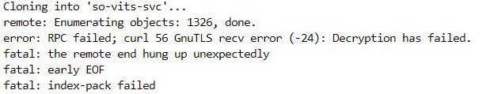
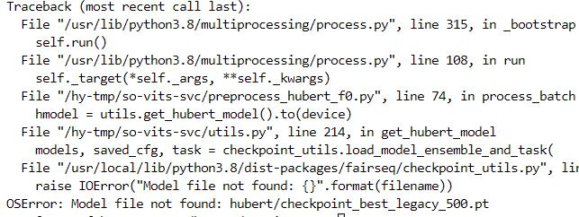
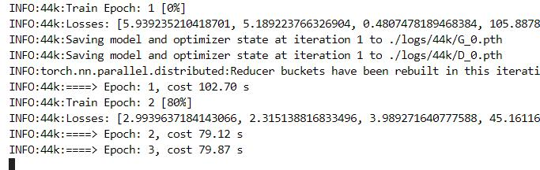

[TOC]


# 前言：

<font color=#1E90FF>Apr 23,2023更新：现在已经可以正常访问,项目已存档并停止维护</font>:https://github.com/svc-develop-team/so-vits-svc

***

<font color=#1E90FF>更新：目前无法正常访问Github原项目地址，据说因为有人用它跑政治敏感的东西所以作者删库跑路了=_=如果属实那么只能手动上传整合包到服务器</font>，

***

体验了一把最近很火的so-vits-svc ，效果确实不错，但是训练模型对低配显卡很不友好，实测GTX 1650要跑一个效果还行的模型（36 epoch ,20K+ steps ）需要接近十个小时。于是考虑在云端部署，对比了几个知名GPU 租借平台，最终选了恒源云的英伟达V100 16G （恒源云打钱！）这配置用来跑sovits 是绰绰有余了，1.5元/小时的价格也比较亲民。如果选用GeForce系列的游戏卡应该能进一步压缩成本，而且效果并不会差太多。写这篇文章时已经换到了RTX 3060 12G ,0.54/小时太香了😀以下均以恒源云为例，其他平台大同小异，注意文件目录。

> 为什么不使用免费的Colab ：首先，由于***众所周知的原因***，大陆无法正常访问谷歌。其次，Colab 目前更改了服务策略，一段时间不使用将会收回资源，这对于需要长时间训练模型的程序来说是不可接受的。
>
> 如果你会***魔法***并且对于自己的***网络施法工具***有信心，可以试试在Colab 上部署： https://colab.research.google.com/github/svc-develop-team/so-vits-svc/blob/4.0/sovits4_for_colab.ipynb

<font color=#7FFF00>关于该项目的**本地化**使用，睿站已经有很详细的保姆级教程了，参见 https://www.bilibili.com/video/BV1H24y187Ko 本文只是介绍云端部署时的主要流程、遇到的报错及解决办法。</font>（一定要看！）

> 一般情况下GPU 服务器均为Linux 系统，需要Windows 图形界面的可以去腾讯和阿里这些平台看看。关于上述视频发布的整合包只适用于Windows 系统，要在Linux 上运行可以考虑使用`Wine ` 。

---

# 准备工作

租借一张显卡，创建一个实例，然后在公共网盘处授权，以便后续下载数据集。进入`JupyterLab` ,选择`terminal` 终端。依次执行下列命令下载cli 工具：

```bash
#安装cli
curl -L https://download.gpushare.com/download/gpushare-cli-linux -o /usr/local/bin/gpushare-cli
chmod u+x /usr/local/bin/gpushare-cli

#验证是否安装成功
gpushare-cli version
```

如果服务器抽风下载很慢建议复制https 地址到浏览器手动下载然后上传到实例。或者直接释放，重开一台实例。

依次执行下列命令安装解压工具：

```bash
apt-get update
apt-get install p7zip-full -y
```

将处理好的数据集压缩并上传到网盘。

# 预处理

准备工作就绪，下面开始部署项目。注意切换到数据盘`cd hy-tmp` ,别把系统盘给干废了。先把项目扒到本地：

```bash 
git clone https://github.com/svc-develop-team/so-vits-svc.git 
```

这时出现了第一个报错：



clone 出错，不用想，肯定是GFW 在作妖。~~GFW 你坏事做尽！~~如果是本地，我会直接改hosts 或者使用DevSideCar ，或者干脆开***魔法***全局加速，然而在Linux 上这些操作都比较繁琐，所以我会使用`gitclone` 代理：

```bash
git clone https://gitclone.com/github.com/svc-develop-team/so-vits-svc.git
```

这时应该很快就扒下来了。

```bash
#进入数据集目录
cd /hy-tmp/so-vits-svc/dataset_raw
#登陆网盘，注意用户名和密码是控制台的用户名密码
gpushare-cli login -u 你的用户名 -p 你的密码
```

 以百度网盘为例

```
#展开网盘内容
gpushare-cli baidu ls
```

找到已经处理好的数据集

```bash
#下载数据集
gpushare-cli baidu down /网盘中数据集的路径 /hy-tmp/so-vits-svc/dataset_raw
```

使用`7z`命令解压：

```bash
7z x 数据集名称.zip -o/hy-tmp/so-vits-svc/dataset_raw
```

`unzip` 命令也是可以的，但是遇到大文件容易报错。

接下来安装运行库：

```bash
#回到上级目录
cd /hy-tmp/so-vits-svc
```

```bash
#安装运行库，后续如果提示缺少某模块那就单独pip安装一次，例如pip install librosa
pip install -r requirements.txt
```

待安装完成后依次运行下列命令开始预处理：

```python
#重采样
python resample.py
#预处理配置
python preprocess_flist_config.py
#预处理hubert和f0
python preprocess_hubert_f0.py
```

此时出现第二次报错：



缺少**checkpoint_best_legacy_500.pt** 文件。文档中说这是一个预训练模型，我们可以`wget` 下载：

```bash
wget hubert/ http://obs.cstcloud.cn/share/obs/sankagenkeshi/checkpoint_best_legacy_500.pt -P /hy-tmp/so-vits-svc/hubert
```


下载完成后再次执行`python preprocess_hubert_f0.py` 。此时应该还有一次报错，但不影响运行，程序开始生成`hubert` 和`f0` 文件。

# 训练

生成完毕后就可以开始训练了。由于训练需要很长时间，建议使用`tmux` ，这样即使关闭了ssh 程序还能继续运行。

```bash
tmux new -s 会话名称
```

在新建的会话窗口执行训练命令：

```python
python train.py -c configs/config.json -m 44k
```

出现train epoch 时表示开始训练了。

# 推理

训练到合适的步数就可以开始推理，参考官方文档：

```bash
python inference_main.py -m "logs/44k/G_30400.pth" -c "configs/config.json" -s "nen" -n "君の知らない物語-src.wav" -t 0
```

其中`-m` 是模型的路径，G 后面的数字代表训练步数；`-c` 是配置文件的路径；`-s` 是说话者的名字，也就是数据集文件夹的名称；

`-n` 是歌声片段，需手动上传至`/raw` 文件夹;`-t` 是移调，正负值均可，如`-12` 就是降低一个八度，`7` 就是升高一个纯五度。

（QAQ乐理有什么难的？.jpg）其他可选参数见官方文档：https://github.com/svc-develop-team/so-vits-svc#-inference

如果觉得推理这一步过于复杂可以参考前述视频的整合包，那个有图形界面，而且相比于推理，吃的配置稍微低一些，GTX 1650 可以跑个30 秒左右的音频。可以在云端训练然后把训练好的模型下载到本地进行推理。

至此云端部署过程结束。这是直接`git clone` 的项目，所以报错较少。如果头铁一定要在Linux 下运行适用于Windows 的整合包那么报错会非常多。

# Q&A

> Q：需要的环境和框架？
>
> A：支持CUDA 的N 卡，Python 3.8 ，Pytorch 。

> Q：如何查看显驱对应的CUDA版本？
>
> A：Linux 使用`nvcc -v` ,Windows 使用`nvidia-smi.exe` ，注意CUDA版本大于等于11.7请下载11.7。

> Q：看不懂的和CUDA有关的报错？
>
> A：大概率爆显存了，改`Batch Size` （参考前述视频）

> Q：CUDA版本不对？
>
> A：安装这三个库（注意torch 、CUDA 以及系统版本，以CUDA11.7 、torch 1.13 、Windows 64 位为例）：①https://download.pytorch.org/whl/cu117/torch-1.13.0%2Bcu117-cp310-cp310-win_amd64.whl，②https://download.pytorch.org/whl/cu117/torchaudio-0.13.0%2Bcu117-cp310-cp310-win_amd64.whl ,③https://download.pytorch.org/whl/cu117/torchvision-0.14.0%2Bcu117-cp310-cp310-win_amd64.whl
>
> 由于**众所周知的原因**这几个包下载会很慢，有能力请使用**魔法**。下载完之后别忘了安装：
>
> ```bash
> pip install .\torch-1.13.0+cu117-cp310-cp310-win_amd64.whl
> pip install .\torchaudio-0.13.0+cu117-cp310-cp310-win_amd64.whl
> pip install .\torchvision-0.14.0+cu117-cp310-cp310-win_amd64.whl
> ```

> Q：为什么运行不了整合包里的批处理？
>
> A：那个是为Windows 写的，而你使用的是Linux 服务器。
> ```bash
> #安装Wine
> apt-get install wine
> #在Wine 中运行批处理
> Wine /hy-tmp/so-vits-svc/批处理名称.bat
> #如果上一条命令无效请在Wine 中运行命令行，在命令行中运行批处理
> Wine cmd
> cd /hy-tmp/so-vits-svc
> 批处理名称.bat

> Q:明明是N 卡，但是还是提示不支持CPU 训练是怎么回事？
>
> A:驱动或者CUDA 版本不对，无法识别。

其他报错请移步前述视频评论区。
